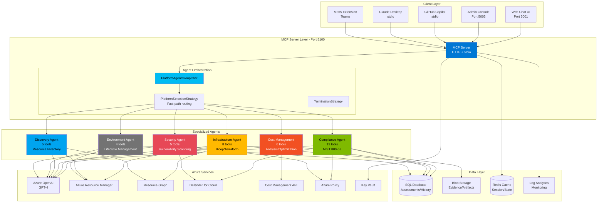
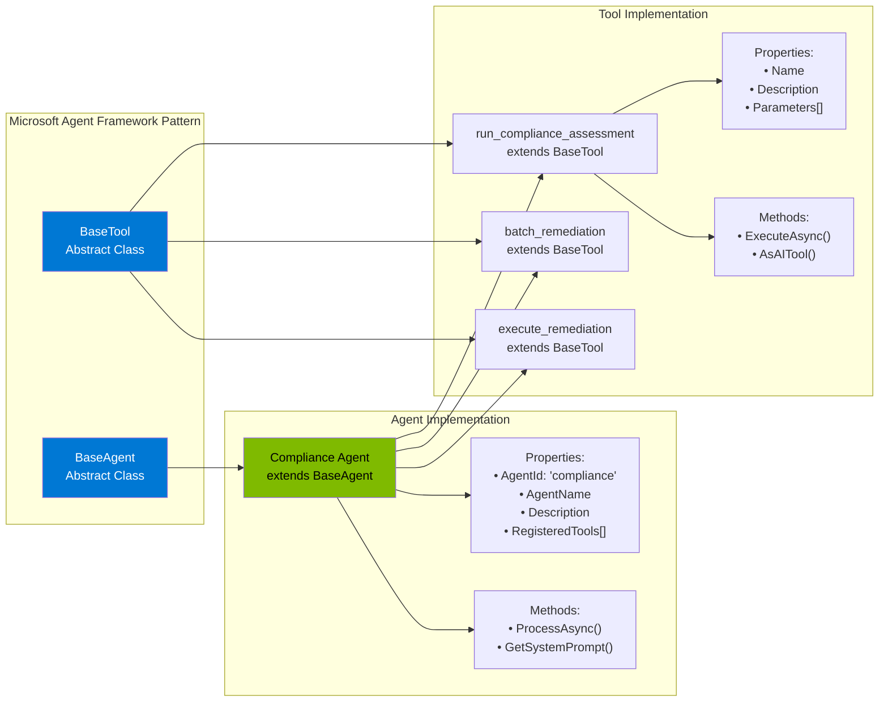
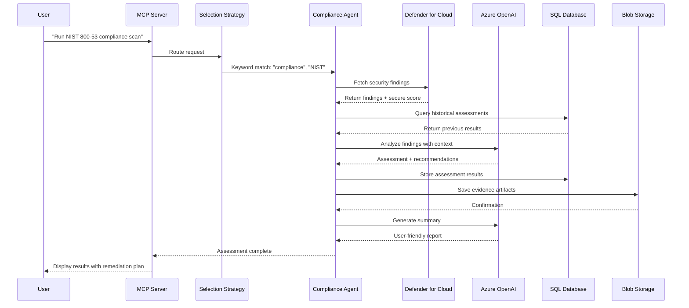
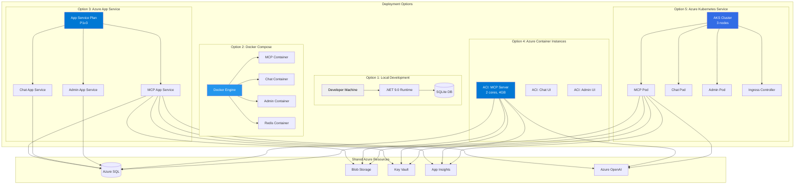
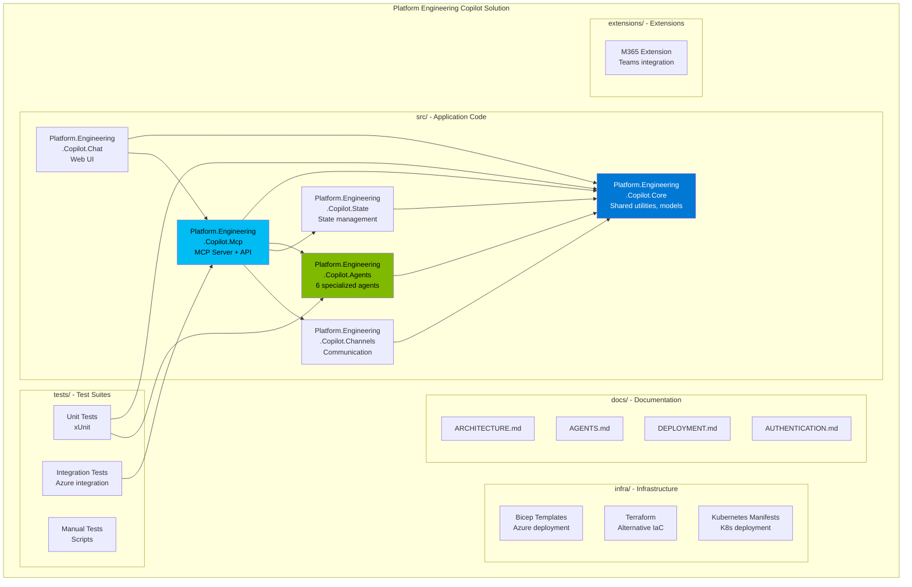
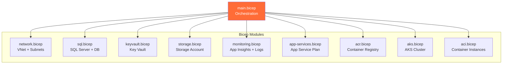
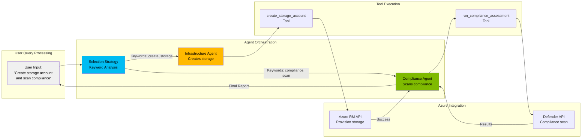
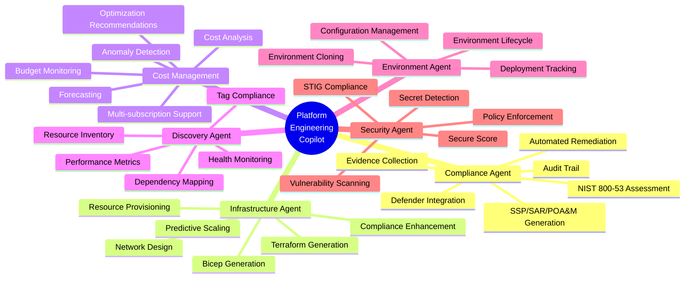
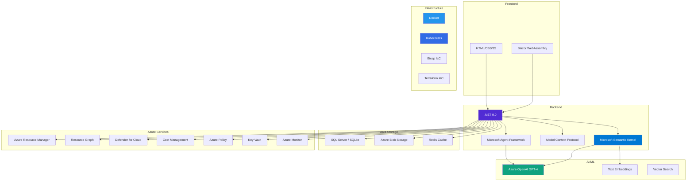

# Platform Engineering Copilot - Visual Architecture

## System Overview

## Agent Architecture (Microsoft Agent Framework)

## Data Flow - Compliance Assessment Example

## Deployment Architecture Options

## Solution Project Structure

## Infrastructure Components (Bicep Modules)

## Agent Interaction Flow

## Key Features by Agent

## Technology Stack

---

## Legend

- **Blue Components**: Core platform services
- **Green Components**: AI agents
- **Orange Components**: Infrastructure/deployment
- **Red Components**: Security-related
- **Gray Components**: Supporting services

