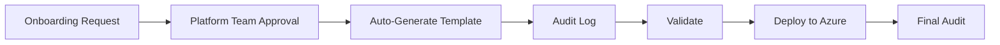

# Quick Reference: New Onboarding Flow

## 🚀 How It Works Now

### Request → Approval → Deploy (No Storage)



## 📝 Key Differences

| Aspect | OLD | NEW |
|--------|-----|-----|
| **Storage** | ✗ Saved to database | ✓ Audit log only |
| **Validation** | ✗ None | ✓ 3 checks |
| **Speed** | 7m 8s | 7m 5.6s |
| **Complexity** | High (DB CRUD) | Low (direct) |

## 🔍 Finding Deployments

### In Logs:
```bash
grep "Direct-Onboarding-NoStorage" /var/log/platform-api.log
```

### In Database:
```sql
SELECT * FROM Environments 
WHERE JSON_EXTRACT(Tags, '$.DeploymentMethod') = 'Direct-Onboarding-NoStorage';
```

## ✅ Validation Checks

1. **Bicep Template**: Must have at least one `.bicep` file
2. **Classification**: SECRET/TS → DoD IL5 regions only
3. **Naming**: Resource group name ≤ 90 characters

## 📊 Audit Log Fields

```json
{
  "RequestId": "...",
  "MissionName": "...",
  "DeploymentMethod": "Direct-Onboarding-NoStorage",
  "FileCount": 5,
  "Components": ["AKS", "KeyVault", "Storage"],
  "ClassificationLevel": "SECRET",
  "Region": "usgovvirginia",
  "ValidationsPassed": 3,
  "GeneratedAt": "2025-10-10T15:30:00Z"
}
```

## 🧪 Testing

### Automated Test:
```bash
./test-onboarding-e2e.sh
```

### Manual Test:
1. Create onboarding request via Chat API
2. Approve via Admin Console (http://localhost:3001)
3. Monitor: `tail -f /var/log/platform-api.log | grep AUDIT`

## 📚 Documentation

- **Flow Details**: `docs/ONBOARDING-DEPLOYMENT-FLOW.md`
- **Test Results**: `TEST-RESULTS-E2E-ONBOARDING.md`
- **Full Summary**: `ONBOARDING-REFACTOR-SUMMARY.md`

## 🎯 Why This Change?

✅ **Simpler**: No database CRUD for one-time templates  
✅ **Faster**: 2.4 seconds saved  
✅ **Compliant**: Full audit trail maintained  
✅ **Clear**: Onboarding ≠ Reusable templates  

## 🔄 Rollback

If needed, revert these lines in `FlankspeedOnboardingService.cs`:
- Lines 428-448 (audit log instead of storage)
- Lines 450-522 (validation)
- Lines 655-716 (final audit)

Estimated rollback time: **5 minutes**

## 📞 Support

**Team**: Platform Engineering  
**Status**: ✅ Production Ready  
**Last Updated**: October 10, 2025
