# Agent Coordination Workflow Diagrams

> **Visual Guide:** Understanding how agents coordinate through OrchestratorAgent

---

## Table of Contents

1. [High-Level Architecture](#high-level-architecture)
2. [Basic Workflows](#basic-workflows)
3. [Advanced Orchestration Patterns](#advanced-orchestration-patterns)
4. [Error Handling & Rollback](#error-handling--rollback)
5. [Real-World Scenarios](#real-world-scenarios)

---

## High-Level Architecture

### System Overview

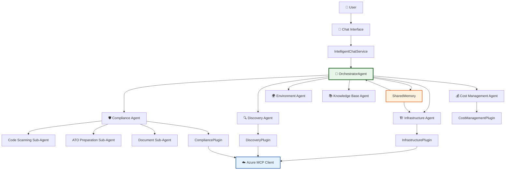

### Agent Interaction Rules

```
┌─────────────────────────────────────────────────────────────┐
│                   COORDINATION RULES                         │
├─────────────────────────────────────────────────────────────┤
│ ✅ Agents communicate ONLY via OrchestratorAgent           │
│ ✅ Agents share context via SharedMemory (singleton)        │
│ ✅ ConfigurationPlugin shared by ALL agents (subscription)  │
│ ✅ Sub-agents (Code, ATO, Document) use same AgentType     │
│ ❌ NO direct agent-to-agent function calls                  │
│ ❌ NO circular dependencies                                 │
│ ❌ NO shared mutable state (except SharedMemory)           │
└─────────────────────────────────────────────────────────────┘
```

---

## Basic Workflows

### 1. Single Agent Request

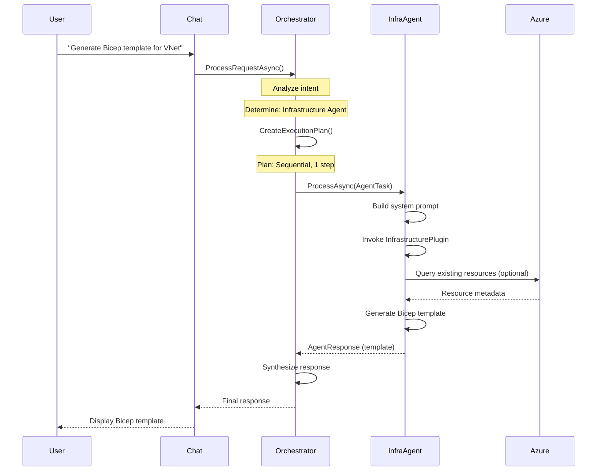

**Key Points:**
- Simple intent → Single agent execution
- No SharedMemory needed for isolated requests
- Orchestrator handles routing automatically

---

### 2. Sequential Multi-Agent Workflow

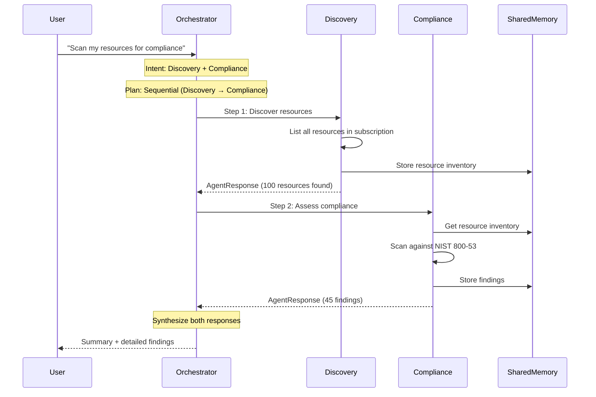

**Key Points:**
- Discovery runs first to populate SharedMemory
- Compliance reads from SharedMemory
- Sequential execution ensures data availability

---

### 3. Parallel Multi-Agent Workflow

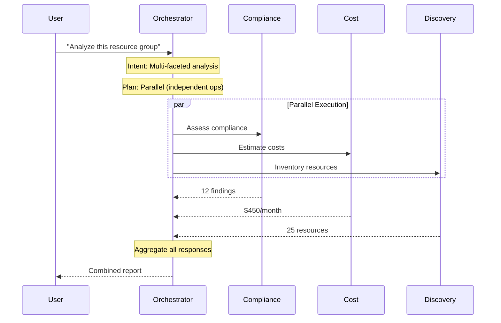

**Key Points:**
- Independent operations run in parallel
- Faster execution (no blocking)
- Orchestrator aggregates results

---

## Advanced Orchestration Patterns

### 4. Compliance Remediation Flow

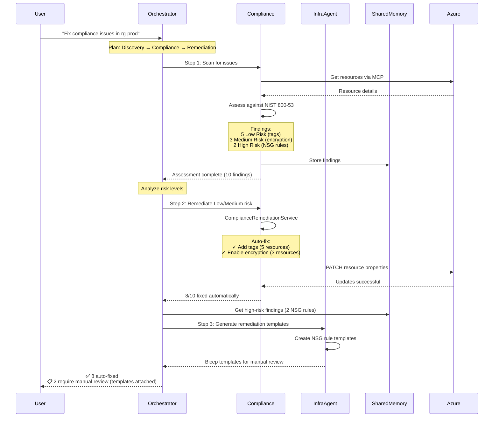

**Key Decisions:**
- Low/Medium risk: Compliance Agent handles via API
- High risk: Infrastructure Agent generates templates
- Orchestrator coordinates based on risk levels

---

### 5. Environment Provisioning with Compliance

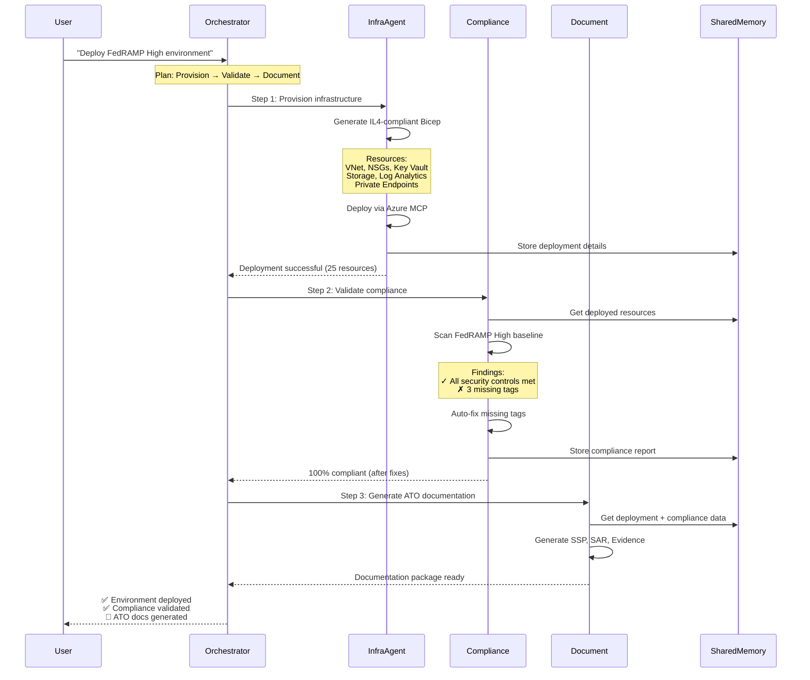

**Workflow Benefits:**
- Infrastructure deployed with compliance baseline
- Automatic validation after provisioning
- Documentation auto-generated from actual state

---

### 6. Cost-Aware Infrastructure Design

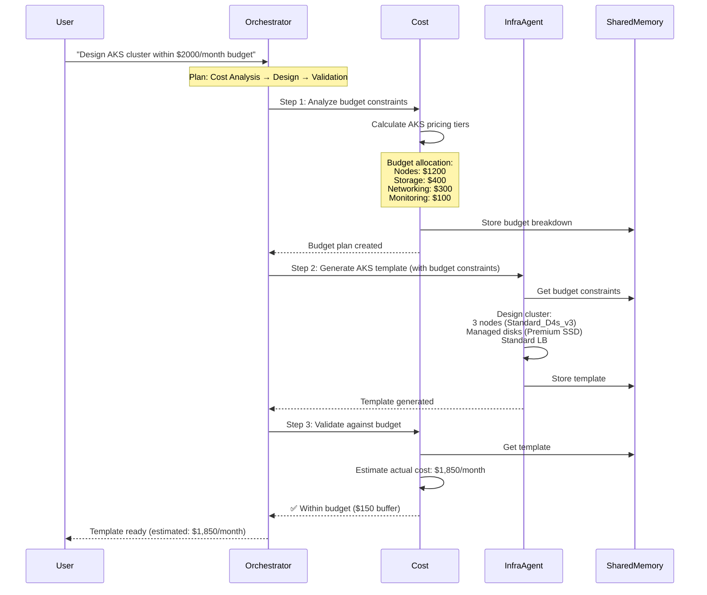

**Coordination Pattern:**
- Cost Agent sets constraints
- Infrastructure Agent respects constraints via SharedMemory
- Cost Agent validates final design

---

## Error Handling & Rollback

### 7. Failed Remediation with Rollback

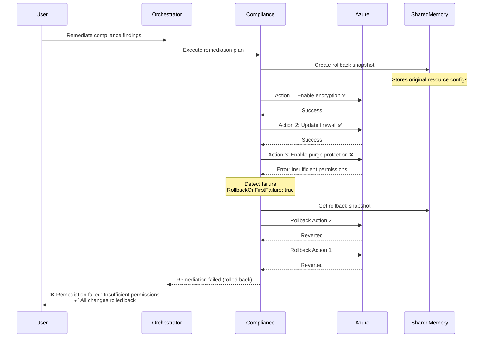

**Safety Features:**
- Snapshot before changes
- Rollback on first failure
- Return to original state

---

### 8. Partial Success Handling

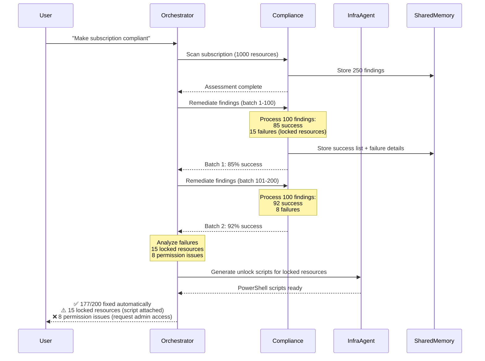

**Partial Success Strategy:**
- Continue on non-critical errors
- Track successes and failures separately
- Provide actionable next steps

---

## Real-World Scenarios

### 9. Complete ATO Preparation Workflow

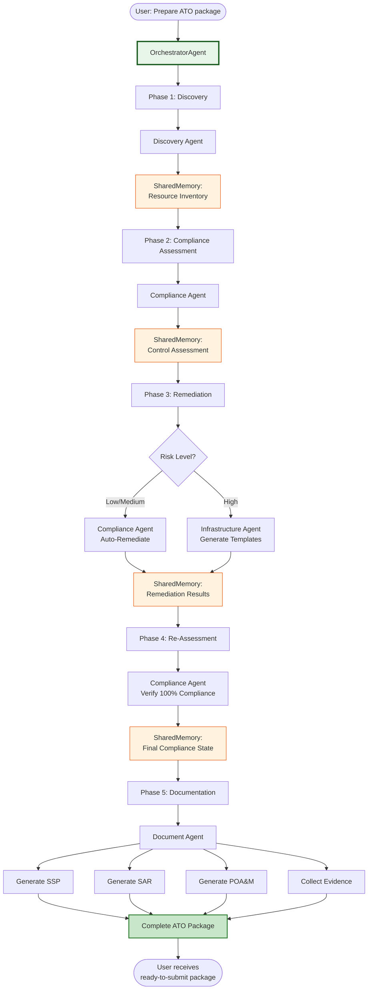

**Execution Plan:**
```yaml
Total Phases: 5
Estimated Duration: 45-60 minutes (automated)
Agent Coordination:
  - Phase 1: Discovery Agent (5 min)
  - Phase 2: Compliance Agent - Assessment (15 min)
  - Phase 3: Compliance + Infrastructure Agents (10-20 min)
  - Phase 4: Compliance Agent - Validation (5 min)
  - Phase 5: Document Agent (10-15 min)

SharedMemory Usage:
  - Resource inventory (Phase 1 → Phase 2)
  - Control findings (Phase 2 → Phase 3)
  - Remediation results (Phase 3 → Phase 4)
  - Compliance state (Phase 4 → Phase 5)
```

---

### 10. Multi-Subscription Compliance Rollout

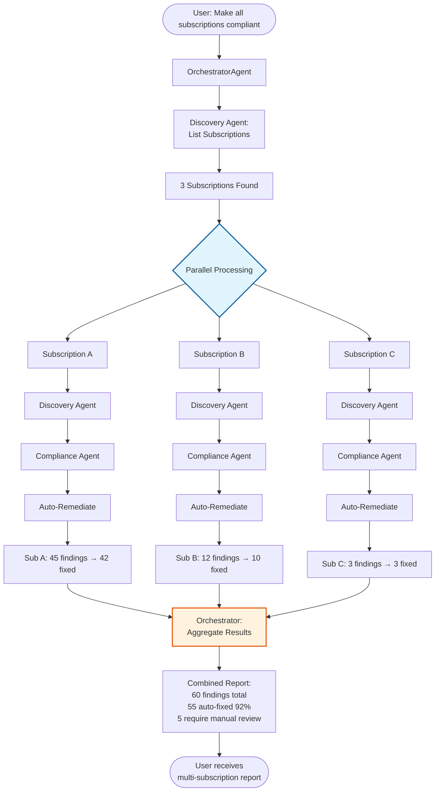

---

## Summary: Key Coordination Patterns

### Pattern Types

| Pattern | Use Case | Agent Flow | Execution |
|---------|----------|------------|-----------|
| **Single Agent** | Simple requests | User → Orchestrator → Agent → User | Fast, direct |
| **Sequential** | Dependent steps | Agent A → Memory → Agent B | Ordered, data flow |
| **Parallel** | Independent ops | Agent A ‖ Agent B ‖ Agent C | Fast, concurrent |
| **Remediation** | Fix compliance | Compliance (assess) → Compliance/Infra (fix) | Risk-based routing |
| **Provision + Validate** | Deploy infrastructure | Infra → Compliance → Document | Quality assurance |
| **Cost-Aware Design** | Budget constraints | Cost → Infra → Cost | Constraint checking |
| **Multi-Subscription** | Enterprise scale | Parallel per subscription | Scalable |

### SharedMemory Data Flow

```
┌─────────────────────────────────────────────────────┐
│               SharedMemory Contents                  │
├──────────────┬──────────────────────────────────────┤
│ Key          │ Value                                │
├──────────────┼──────────────────────────────────────┤
│ resources    │ List of discovered resources         │
│ findings     │ Compliance assessment results        │
│ remediation  │ Remediation plan + execution results │
│ deployment   │ Infrastructure deployment details    │
│ costs        │ Cost estimates and breakdowns        │
│ evidence     │ Collected evidence for controls      │
│ rollback     │ Resource snapshots for rollback      │
└──────────────┴──────────────────────────────────────┘
```

### Orchestration Decision Tree

```
User Request
    ↓
Intent Analysis
    ├─ Single Domain? → Single Agent (direct)
    ├─ Multiple Domains? → Multi-Agent Workflow
    │   ├─ Independent? → Parallel Execution
    │   └─ Dependent? → Sequential Execution
    ├─ Compliance + Remediation? → Risk-Based Routing
    │   ├─ Low Risk → Compliance Agent (auto)
    │   ├─ Medium Risk → Compliance Agent (confirm)
    │   └─ High Risk → Infrastructure Agent (templates)
    └─ Provisioning? → Provision → Validate → Document
```

### Best Practices

✅ **DO:**
- Use SharedMemory for cross-agent data
- Plan execution order carefully (sequential vs parallel)
- Handle partial failures gracefully
- Provide rollback for risky operations
- Aggregate results from parallel executions

❌ **DON'T:**
- Call agents directly (always via Orchestrator)
- Assume agents run in specific order (declare dependencies)
- Ignore error states (handle and communicate)
- Auto-execute high-risk operations
- Skip validation after remediation
