# Platform Engineering Copilot - Architecture Diagram

## Multi-Agent System Architecture

```mermaid
graph TB
    %% User Interface Layer
    User[👤 Chat Users]
    WebApp[🌐 Q&A Web App<br/>React/TypeScript]
    
    %% API Gateway Layer
    ChatAPI[💬 Chat API<br/>ASP.NET Core]
    AdminAPI[⚙️ Admin API<br/>Management]
    
    %% Orchestration Layer
    Orchestrator[🎯 Orchestrator Agent<br/>Intent Classification<br/>Execution Planning<br/>Agent Coordination]
    
    %% Specialized Agents
    InfraAgent[🏗️ Infrastructure Agent<br/>Bicep/Terraform Generation<br/>Network Design<br/>Predictive Scaling<br/>Compliance Templates]
    
    ComplianceAgent[🛡️ Compliance Agent<br/>NIST 800-53<br/>FedRAMP High<br/>DoD IL5<br/>RMF/ATO]
    
    CostAgent[💰 Cost Management Agent<br/>Cost Analysis<br/>Budget Tracking<br/>Optimization]
    
    DiscoveryAgent[🔍 Discovery Agent<br/>Resource Inventory<br/>Tagging Analysis<br/>Resource Search]
    
    EnvAgent[🌍 Environment Agent<br/>Deployment<br/>Validation<br/>Configuration]
    
    SecurityAgent[🔐 Security Agent<br/>Threat Detection<br/>Vulnerability Scan<br/>Policy Enforcement]
    
    DocAgent[📝 Document Agent<br/>RMF Documentation<br/>SSP Generation<br/>Technical Docs]
    
    %% Shared Services Layer
    SharedMemory[🧠 Shared Memory<br/>Conversation Context<br/>Agent Communication<br/>Template Storage]
    
    SemanticKernel[⚙️ Semantic Kernel<br/>LLM Orchestration<br/>Function Calling<br/>Plugin Management]
    
    %% Plugin System
    InfraPlugin[📦 Infrastructure Plugin<br/>Template Generation<br/>Network Design<br/>Scaling Analysis]
    
    DeployPlugin[📦 Deployment Plugin<br/>Bicep Deployment<br/>Azure Resource Manager]
    
    CompliancePlugin[📦 Compliance Plugin<br/>Policy Validation<br/>Control Assessment]
    
    %% Knowledge Base Layer
    VectorDB[🔮 Vector Database<br/>Azure AI Search<br/>Embeddings<br/>Semantic Search]
    
    CosmosDB[(🗄️ Cosmos DB<br/>Conversation History<br/>Source Documents<br/>Q&A Persistence)]
    
    BlobStorage[(💾 Blob Storage<br/>Generated Templates<br/>System Prompts<br/>Source Metadata)]
    
    %% External Services Layer
    AzureOpenAI[🤖 Azure OpenAI<br/>GPT-4o<br/>Embeddings API<br/>Function Calling]
    
    AzureMCP[🔧 Azure MCP Server<br/>Best Practices<br/>Schema Validation<br/>Resource Provider APIs]
    
    AzureRM[☁️ Azure Resources<br/>Subscriptions<br/>Resource Groups<br/>Resources]
    
    %% User Flow
    User -->|Ask Question| WebApp
    WebApp -->|Submit Query| ChatAPI
    
    %% API to Orchestrator
    ChatAPI -->|Route Request| Orchestrator
    AdminAPI -->|Manage Config| SharedMemory
    
    %% Orchestrator to Agents
    Orchestrator -->|Delegate Task| InfraAgent
    Orchestrator -->|Delegate Task| ComplianceAgent
    Orchestrator -->|Delegate Task| CostAgent
    Orchestrator -->|Delegate Task| DiscoveryAgent
    Orchestrator -->|Delegate Task| EnvAgent
    Orchestrator -->|Delegate Task| SecurityAgent
    Orchestrator -->|Delegate Task| DocAgent
    
    %% Agents to Shared Services
    InfraAgent -->|Use| SemanticKernel
    ComplianceAgent -->|Use| SemanticKernel
    CostAgent -->|Use| SemanticKernel
    DiscoveryAgent -->|Use| SemanticKernel
    EnvAgent -->|Use| SemanticKernel
    SecurityAgent -->|Use| SemanticKernel
    DocAgent -->|Use| SemanticKernel
    
    %% Agents to Shared Memory
    InfraAgent <-->|Share Context| SharedMemory
    ComplianceAgent <-->|Share Context| SharedMemory
    CostAgent <-->|Share Context| SharedMemory
    DiscoveryAgent <-->|Share Context| SharedMemory
    EnvAgent <-->|Share Context| SharedMemory
    SecurityAgent <-->|Share Context| SharedMemory
    DocAgent <-->|Share Context| SharedMemory
    Orchestrator <-->|Coordinate| SharedMemory
    
    %% Plugins
    InfraAgent -->|Use| InfraPlugin
    InfraAgent -->|Use| DeployPlugin
    ComplianceAgent -->|Use| CompliancePlugin
    
    %% Semantic Kernel to LLM
    SemanticKernel -->|Request Completion| AzureOpenAI
    SemanticKernel -->|Request Embeddings| AzureOpenAI
    
    %% Knowledge Base
    SemanticKernel -->|Search Context| VectorDB
    VectorDB <-->|Index/Retrieve| CosmosDB
    VectorDB <-->|Store Vectors| BlobStorage
    
    %% External Integrations
    InfraPlugin -->|Fetch Best Practices| AzureMCP
    DeployPlugin -->|Deploy Resources| AzureRM
    DiscoveryAgent -->|Query Resources| AzureRM
    CompliancePlugin -->|Scan Resources| AzureRM
    CostAgent -->|Get Cost Data| AzureRM
    
    %% Response Flow
    InfraAgent -->|Return Result| Orchestrator
    ComplianceAgent -->|Return Result| Orchestrator
    CostAgent -->|Return Result| Orchestrator
    DiscoveryAgent -->|Return Result| Orchestrator
    EnvAgent -->|Return Result| Orchestrator
    SecurityAgent -->|Return Result| Orchestrator
    DocAgent -->|Return Result| Orchestrator
    
    Orchestrator -->|Aggregate Response| ChatAPI
    ChatAPI -->|Return Answer| WebApp
    WebApp -->|Display| User
    
    %% Styling
    classDef userLayer fill:#e1f5ff,stroke:#01579b,stroke-width:2px
    classDef apiLayer fill:#fff3e0,stroke:#e65100,stroke-width:2px
    classDef orchestratorLayer fill:#f3e5f5,stroke:#4a148c,stroke-width:2px
    classDef agentLayer fill:#e8f5e9,stroke:#1b5e20,stroke-width:2px
    classDef sharedLayer fill:#fff9c4,stroke:#f57f17,stroke-width:2px
    classDef pluginLayer fill:#fce4ec,stroke:#880e4f,stroke-width:2px
    classDef dataLayer fill:#e0f2f1,stroke:#004d40,stroke-width:2px
    classDef externalLayer fill:#efebe9,stroke:#3e2723,stroke-width:2px
    
    class User,WebApp userLayer
    class ChatAPI,AdminAPI apiLayer
    class Orchestrator orchestratorLayer
    class InfraAgent,ComplianceAgent,CostAgent,DiscoveryAgent,EnvAgent,SecurityAgent,DocAgent agentLayer
    class SharedMemory,SemanticKernel sharedLayer
    class InfraPlugin,DeployPlugin,CompliancePlugin pluginLayer
    class VectorDB,CosmosDB,BlobStorage dataLayer
    class AzureOpenAI,AzureMCP,AzureRM externalLayer
```

## Infrastructure Agent - Conversational Requirements Gathering Flow

## Data Flow - Template Generation vs Actual Provisioning

```mermaid
graph LR
    %% Template Generation Flow (Safe)
    subgraph TemplateGen["📝 Template Generation (Safe - No Azure Resources Created)"]
        direction TB
        TG1[User Request:<br/>'I need AKS cluster']
        TG2[Infrastructure Agent<br/>Asks Questions]
        TG3[User Provides Answers]
        TG4[Generate Bicep Template]
        TG5[Store in SharedMemory]
        TG6[Return Code to User]
        
        TG1 --> TG2 --> TG3 --> TG4 --> TG5 --> TG6
    end
    
    %% Actual Provisioning Flow (Creates Resources)
    subgraph ActualProv["⚠️ Actual Provisioning (Creates Real Azure Resources)"]
        direction TB
        AP1[User Request:<br/>'Actually provision this']
        AP2[Infrastructure Agent<br/>Retrieves Template]
        AP3[Environment Agent<br/>Deploys to Azure]
        AP4[Discovery Agent<br/>Verifies Resources]
        AP5[Compliance Agent<br/>Scans New Resources]
        AP6[Cost Agent<br/>Estimates Costs]
        
        AP1 --> AP2 --> AP3 --> AP4 --> AP5 --> AP6
    end
    
    TemplateGen -.->|"User decides<br/>to provision"| ActualProv
    
    style TemplateGen fill:#e8f5e9,stroke:#1b5e20,stroke-width:3px
    style ActualProv fill:#ffebee,stroke:#c62828,stroke-width:3px
```

## Agent Execution Patterns

## Technology Stack

| Layer | Technology | Purpose |
|-------|-----------|---------|
| **Frontend** | React, TypeScript | Q&A Web Interface |
| **API** | ASP.NET Core 9.0 | REST API, WebSockets |
| **Orchestration** | Semantic Kernel | LLM coordination, plugin management |
| **LLM** | Azure OpenAI GPT-4o | Function calling, conversation |
| **Embeddings** | Azure OpenAI text-embedding-3-large | Semantic search |
| **Vector DB** | Azure AI Search | Hybrid search (vector + keyword) |
| **Document Store** | Cosmos DB | Conversation history, Q&A pairs |
| **Blob Storage** | Azure Blob Storage | Templates, source documents |
| **MCP Server** | Azure MCP | Best practices, schema validation |
| **IaC** | Bicep, Terraform | Infrastructure as Code |
| **Deployment** | Azure Resource Manager | Resource provisioning |

## Key Features

### 🤖 Conversational Requirements Gathering
- Agents ask targeted questions before taking action
- Smart defaults based on environment type
- One question cycle maximum
- Context maintained across conversation turns

### 🔮 Intelligent Agent Routing
- Intent classification by Orchestrator
- Multi-agent workflows (sequential, parallel, collaborative)
- Execution plan validation
- Agent-to-agent communication via SharedMemory

### 🛡️ Compliance-Aware Templates
- Automatic injection of security controls
- FedRAMP High, DoD IL5, NIST 800-53, SOC2, GDPR
- Template validation against compliance frameworks
- RMF/ATO documentation generation

### 📊 Predictive Scaling
- Forecast resource needs (hours, days, weeks ahead)
- Auto-scaling optimization
- Historical performance analysis
- Cost impact assessment

### 🔧 Azure MCP Integration
- Real-time Azure best practices
- Schema validation against Azure Resource Provider APIs
- Enhanced security hardening
- Graceful fallback if MCP unavailable

## Deployment Architecture

---

**Last Updated:** November 12, 2025  
**Version:** 0.6.35
