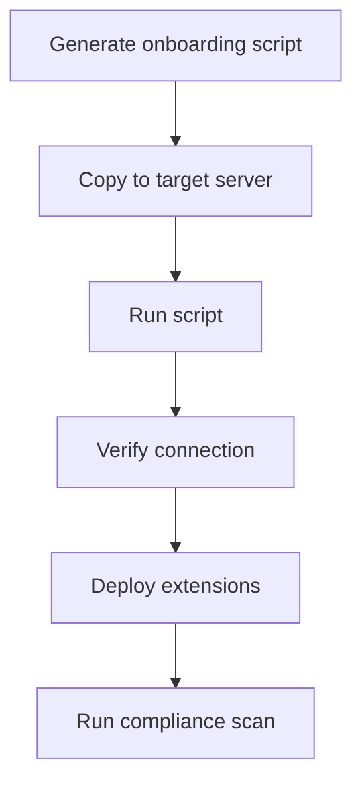
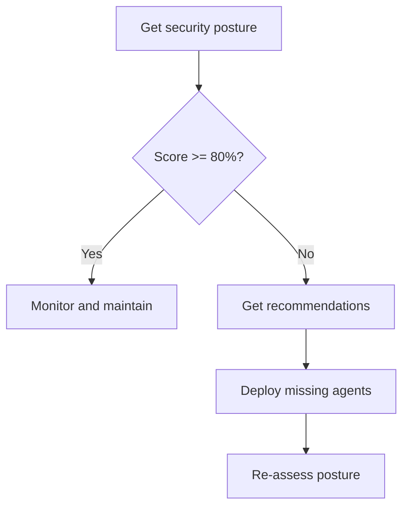
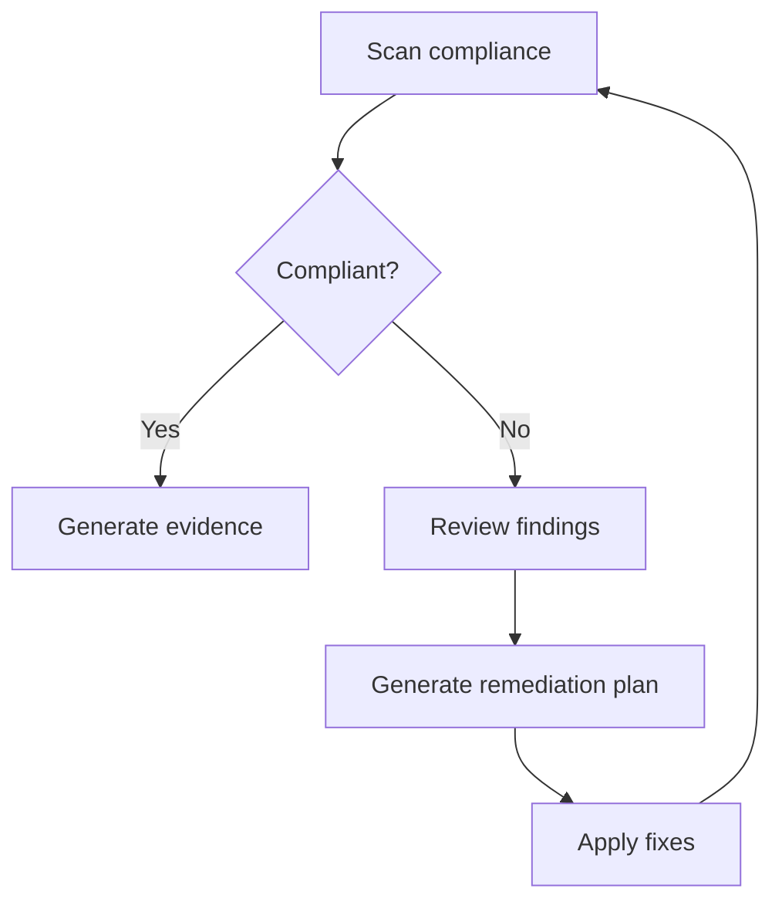

# Azure Arc Integration Guide

> Comprehensive documentation for Azure Arc hybrid infrastructure management capabilities across all Platform Engineering Copilot agents

## Overview

Platform Engineering Copilot provides **full lifecycle management for Azure Arc-connected hybrid machines**. This enables organizations to extend Azure management, compliance, and security capabilities to on-premises servers, edge devices, and multi-cloud infrastructure.

### What is Azure Arc?

Azure Arc extends Azure management and services to any infrastructure, enabling:
- **Unified Management**: Manage Windows and Linux servers across on-premises, edge, and multi-cloud from Azure
- **Azure Policy**: Apply governance and compliance policies to hybrid resources
- **Security**: Enable Microsoft Defender for Servers on non-Azure machines
- **Monitoring**: Use Azure Monitor for logs, metrics, and alerting
- **Configuration**: Apply Guest Configuration baselines (STIG, CIS, custom)

### Arc Capabilities by Agent

| Agent | Capabilities | Functions |
|-------|-------------|-----------|
| 🔍 **Discovery** | Inventory, health monitoring, extension tracking | 4 functions |
| 🛡️ **Compliance** | STIG/CIS/Azure compliance scanning, Guest Configuration | 3 functions |
| 🏗️ **Infrastructure** | Onboarding scripts, extension deployment at scale | 3 functions |
| 🔐 **Security** | Security posture, Defender status, recommendations | 3 functions |

---

## 🔍 Discovery Agent - Arc Functions

The Discovery Agent provides visibility into your Azure Arc-connected hybrid infrastructure.

### Functions

#### `list_arc_machines`
List all Azure Arc-connected hybrid machines in a subscription.

**Example Prompts:**
```
"List all Arc machines"
"Show me my hybrid servers in the production subscription"
"What Arc-connected machines are in resource group rg-servers?"
```

**Response includes:**
- Machine name, resource group, location
- OS type (Windows/Linux) and version
- Connection status (Connected/Disconnected)
- Agent version and last seen timestamp

---

#### `get_arc_machine_details`
Get detailed information about a specific Arc-connected machine.

**Example Prompts:**
```
"Get details for Arc machine webserver01"
"Show me the configuration of my Arc server db-primary"
```

**Response includes:**
- Full machine properties
- Network configuration (FQDN, domain)
- Agent configuration (Guest Config, Extensions enabled)
- VM UUID, hardware details
- Last heartbeat and status change

---

#### `get_arc_extensions`
List all VM extensions installed on Arc-connected machines.

**Example Prompts:**
```
"What extensions are installed on my Arc machines?"
"Show me the monitoring agents on Arc servers"
"Which Arc machines have Defender installed?"
```

**Response includes:**
- Extension name, publisher, type
- Provisioning state and version
- Installation date
- Coverage summary by extension type

---

#### `get_arc_connection_health`
Check the connection health of Arc-connected machines.

**Example Prompts:**
```
"Check Arc connection health"
"Which hybrid servers are disconnected?"
"Show me Arc machines with connectivity issues"
```

**Response includes:**
- Connection status breakdown
- Health score percentage
- Disconnected machine list with duration
- Troubleshooting recommendations

---

## 🛡️ Compliance Agent - Arc Functions

The Compliance Agent assesses hybrid machine compliance against security baselines.

### Functions

#### `scan_arc_machine_compliance`
Scan Arc-connected machines for compliance against security baselines.

**Example Prompts:**
```
"Scan Arc machines for STIG compliance"
"Check CIS benchmark compliance on my hybrid servers"
"Run compliance assessment on Arc machine webserver01"
```

**Parameters:**
- `machineName`: Specific machine to scan (optional)
- `baseline`: STIG, CIS, Azure, or all (default)
- `resourceGroup`: Filter by resource group

**Response includes:**
- Compliance score percentage
- Findings by severity (Critical/High/Medium/Low)
- NIST 800-53 control family mapping
- Remediation recommendations

---

#### `get_arc_guest_configuration_status`
Check Guest Configuration (Azure Policy) compliance status for Arc machines.

**Example Prompts:**
```
"Show guest configuration status for my Arc servers"
"Which Arc machines failed policy compliance?"
"Get Azure Policy status for hybrid infrastructure"
```

**Response includes:**
- Policy assignment status per machine
- Compliance state (Compliant/NonCompliant/Pending)
- Last evaluation timestamp
- Policy assignment summary

---

#### `get_arc_compliance_summary`
Get high-level compliance summary across all Arc machines.

**Example Prompts:**
```
"Give me an Arc compliance summary"
"What's our hybrid server compliance status?"
"Show executive compliance dashboard for Arc"
```

**Response includes:**
- Overall compliance score
- Control family coverage (AC, AU, CM, IA, SC, SI)
- Risk areas with remediation guidance
- Suitable for ATO documentation

---

## 🏗️ Infrastructure Agent - Arc Functions

The Infrastructure Agent handles Arc onboarding and extension deployment.

### Functions

#### `generate_arc_onboarding_script`
Generate PowerShell or Bash scripts to onboard servers to Azure Arc.

**Example Prompts:**
```
"Generate Arc onboarding script for Windows servers"
"Create Linux Arc enrollment script with proxy settings"
"Generate automated Arc onboarding with service principal"
```

**Parameters:**
- `operatingSystem`: Windows or Linux
- `proxyUrl`: Proxy server URL (optional)
- `tags`: Key=value pairs for resource tagging
- `servicePrincipalId/Secret`: For automated onboarding

**Generated Script includes:**
- Agent download and installation
- Azure authentication (interactive or service principal)
- Proxy configuration (if specified)
- Custom tags for governance
- Connection verification

---

#### `deploy_arc_extensions`
Deploy extensions to Arc-connected machines at scale.

**Example Prompts:**
```
"Deploy Azure Monitor extension to all Arc machines"
"Install Defender on Arc servers in production"
"Deploy core security extensions to hybrid infrastructure"
```

**Supported Extensions:**
| Extension | Purpose |
|-----------|---------|
| `AzureMonitorAgent` | Metrics and log collection |
| `LogAnalytics` | Legacy Log Analytics Agent (MMA) |
| `Defender` | Microsoft Defender for Servers |
| `DependencyAgent` | Service Map dependencies |
| `GuestConfiguration` | Azure Policy compliance |
| `CustomScript` | Run custom scripts |
| `All` | Deploy core monitoring stack |

**Response includes:**
- Deployment plan by OS type
- ARM template for Azure deployment
- Azure CLI commands for manual deployment
- Estimated deployment time

---

#### `get_arc_onboarding_status`
Check the onboarding and connection status of Arc machines.

**Example Prompts:**
```
"Check Arc onboarding status"
"Show me which servers failed to connect"
"Are my newly onboarded servers connected?"
```

**Response includes:**
- Health score percentage
- Connected/Disconnected breakdown
- Recently onboarded machines (last 24 hours)
- Problem machines with troubleshooting steps

---

## 🔐 Security Agent - Arc Functions

The Security Agent assesses security posture and manages threat protection.

### Functions

#### `get_arc_security_posture`
Assess overall security posture of Arc-connected machines.

**Example Prompts:**
```
"What is the security posture of my Arc machines?"
"Show Arc server security status"
"Give me a security assessment of hybrid infrastructure"
```

**Security Metrics Evaluated:**
- Microsoft Defender coverage
- Azure Monitor Agent coverage
- Guest Configuration coverage
- Connection health

**Response includes:**
- Overall security score (weighted average)
- Coverage percentages by category
- Critical and high severity findings
- Prioritized recommendations

---

#### `check_arc_defender_status`
Check Microsoft Defender for Servers status on Arc machines.

**Example Prompts:**
```
"Check Defender status on my Arc servers"
"Which Arc machines don't have Defender?"
"Show Defender coverage for hybrid infrastructure"
```

**Response includes:**
- Defender coverage percentage
- Enabled/Disabled breakdown by OS
- Machines needing Defender deployment
- Azure CLI commands for remediation

---

#### `get_arc_security_recommendations`
Get prioritized security recommendations for Arc machines.

**Example Prompts:**
```
"What security improvements should I make for Arc servers?"
"Give me Arc security recommendations"
"Show me the security gaps in my hybrid infrastructure"
```

**Recommendation Categories:**
- **Critical**: Disconnected machines, no threat protection
- **High**: Missing Defender, no monitoring
- **Medium**: Missing Guest Configuration, outdated agents
- **Low**: Missing tags, configuration best practices

**Response includes:**
- Prioritized recommendation list
- Affected machine count per recommendation
- Remediation commands
- Quick wins for immediate action

---

## Common Workflows

### 1. Onboarding New Servers to Arc



**Steps:**
1. `"Generate Arc onboarding script for Windows"` → Get PowerShell script
2. Copy script to target server and run as Administrator
3. `"Check Arc onboarding status"` → Verify connection
4. `"Deploy Arc extensions All"` → Install monitoring/security
5. `"Scan Arc machine compliance"` → Assess baseline compliance

### 2. Security Assessment Workflow



**Steps:**
1. `"Get Arc security posture"` → Overall assessment
2. `"Get Arc security recommendations"` → Prioritized actions
3. `"Deploy Arc extensions Defender"` → Enable threat protection
4. `"Check Arc Defender status"` → Verify deployment

### 3. Compliance Remediation Workflow



**Steps:**
1. `"Scan Arc machine compliance with STIG baseline"` → Get findings
2. `"Get Arc guest configuration status"` → Policy details
3. `"Generate remediation plan for Arc machines"` → Fix guidance
4. Apply remediation
5. Re-scan to verify compliance

---

## Network Requirements

Arc-connected machines require outbound connectivity (HTTPS/443) to these endpoints:

| Endpoint | Purpose |
|----------|---------|
| `management.azure.com` | Azure Resource Manager |
| `login.microsoftonline.com` | Azure AD authentication |
| `*.his.arc.azure.com` | Arc hybrid identity |
| `*.guestconfiguration.azure.com` | Guest Configuration |
| `*.servicebus.windows.net` | Azure Service Bus |
| `*.blob.core.windows.net` | Agent downloads |

For air-gapped environments, see [Azure Arc Private Link](https://docs.microsoft.com/azure/azure-arc/servers/private-link-security).

---

## Prerequisites

### For Onboarding
- Windows Server 2012 R2+ or supported Linux distribution
- Outbound HTTPS connectivity to Azure
- Administrator/root privileges
- Azure subscription with Contributor access

### For Compliance Scanning
- Arc machine in Connected state
- Guest Configuration extension (recommended)
- Azure Policy assignments for baseline compliance

### For Security Features
- Microsoft Defender for Cloud enabled
- Defender for Servers plan (P1 or P2)
- Azure Monitor Agent for log collection

---

## Troubleshooting

### Machine Shows Disconnected

```bash
# Windows - Check agent status
Get-Service himds

# Linux - Check agent status
sudo systemctl status himdsd

# Verify connectivity
azcmagent check
```

### Extension Deployment Failed

```bash
# List extension status
az connectedmachine extension list --machine-name <name> --resource-group <rg>

# Check extension logs (Windows)
Get-Content "C:\ProgramData\AzureConnectedMachineAgent\Log\ExtensionManager.log" -Tail 50

# Check extension logs (Linux)
sudo tail -50 /var/lib/GuestConfig/ext_mgr_logs/gc_ext.log
```

### Compliance Scan Not Reporting

1. Verify Guest Configuration extension is installed
2. Check extension provisioning state is "Succeeded"
3. Wait for initial policy evaluation (can take up to 30 minutes)
4. Run `azcmagent check` to verify connectivity

---

## Related Documentation

- [Agent Guide](AGENTS.md) - Full agent documentation
- [Agent Coordination Workflows](AGENT-COORDINATION-WORKFLOWS.md) - How agents work together
- [Compliance Agent](Compliance%20Agent/README.md) - Detailed compliance capabilities
- [Leadership Demo Script](LEADERSHIP-DEMO-SCRIPT.md) - Executive demo including Arc

---

## Version History

| Version | Date | Changes |
|---------|------|---------|
| 1.0.0 | December 2024 | Initial Azure Arc integration with 13 functions across 4 agents |
