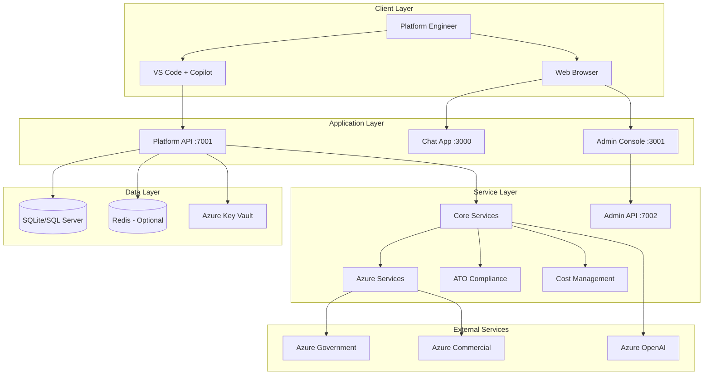

# Development Guide

**Last Updated:** January 17, 2025

This comprehensive guide covers the architecture, development setup, contribution guidelines, and API documentation for the Platform Engineering Copilot.

## 📋 Table of Contents

1. [Architecture Overview](#architecture-overview)
2. [Development Setup](#development-setup)
3. [Project Structure](#project-structure)
4. [Contributing Guidelines](#contributing-guidelines)
5. [API Reference](#api-reference)
6. [Testing](#testing)
7. [Building and Packaging](#building-and-packaging)
8. [Debugging](#debugging)

---

## 🏗️ Architecture Overview

### System Architecture

The Platform Engineering Copilot uses a **direct integration architecture** with clean separation of concerns:


        Azure --> AzureGov[Azure Government]
        Azure --> AzureCommercial[Azure Commercial]
        Tools --> GitHub[GitHub APIs]
        Tools --> K8s[Kubernetes APIs]
    end
```

### Core Components

#### Platform API (`Platform.Engineering.Copilot.API`)
- **Purpose**: Core platform services and tool execution
- **Port**: 7001
- **Technology**: ASP.NET Core Web API, Entity Framework Core 9.0
- **Responsibilities**:
  - RESTful API endpoints for infrastructure operations
  - Semantic Kernel plugin orchestration
  - Azure Resource Manager integration
  - ATO compliance scanning (NIST 800-53 Rev 5)
  - Cost analysis and optimization
  - Natural language query processing

#### Admin API (`Platform.Engineering.Copilot.Admin.API`)
- **Purpose**: Administrative backend API
- **Port**: 7002
- **Technology**: ASP.NET Core Web API
- **Responsibilities**:
  - Template management
  - Approval workflow administration
  - User management
  - Configuration management

#### Admin Console (`Platform.Engineering.Copilot.Admin.Client`)
- **Purpose**: React-based administrative UI
- **Port**: 3001
- **Technology**: React 18, ASP.NET Core (host)
- **Responsibilities**:
  - Template browsing and management
  - Approval workflow UI
  - System configuration
  - User administration

#### Chat App (`Platform.Engineering.Copilot.Chat`)
- **Purpose**: Real-time chat interface for onboarding
- **Port**: 3000
- **Technology**: React, SignalR, ASP.NET Core
- **Responsibilities**:
  - Real-time conversational AI interface
  - Onboarding workflow guidance
  - Natural language interaction
  - Integration with Platform API

#### Core Library (`Platform.Engineering.Copilot.Core`)
- **Purpose**: Business logic and domain services
- **Technology**: .NET 9.0 Class Library
- **Responsibilities**:
  - Semantic Kernel plugins (7 plugins)
  - Domain services (40+ services)
  - Azure service integration
  - Compliance engines (NIST 800-53, Azure Policy)
  - Cost management services
  - Infrastructure provisioning services

#### Data Layer (`Platform.Engineering.Copilot.Data`)
- **Purpose**: Data access and persistence
- **Technology**: Entity Framework Core 9.0
- **Responsibilities**:
  - Entity definitions (20+ entities)
  - Database context (EnvironmentManagementContext)
  - Migrations and seeding
  - Supports: SQLite, SQL Server, In-Memory

#### MCP Server (`Platform.Engineering.Copilot.Mcp`)
- **Purpose**: Model Context Protocol server for AI agents
- **Technology**: .NET 9.0 Console Application
- **Responsibilities**:
  - MCP protocol implementation
  - AI agent integration
  - Tool execution for external agents
- **Responsibilities**:
  - Azure Government Cloud integration
  - Authentication and authorization
  - API rate limiting and throttling
  - Cross-cloud service coordination

### Technology Stack

#### Backend
- **.NET 9.0**: Primary framework
- **ASP.NET Core 9.0**: Web API and hosting
- **Entity Framework Core 9.0**: Data access layer
- **Microsoft Semantic Kernel 1.26.0**: AI orchestration
- **Azure SDK 1.48.0+**: Azure service integration (11+ packages)
- **SignalR 9.0**: Real-time communication
- **Serilog**: Structured logging

#### Frontend
- **React 18**: UI framework for Admin Console and Chat App
- **SignalR Client**: Real-time communication
- **Axios**: HTTP client
- **Tailwind CSS**: Styling framework
- **Monaco Editor**: Code editor component

#### AI & ML
- **Azure OpenAI GPT-4o**: Natural language understanding
- **Semantic Kernel**: AI plugin orchestration and function calling
- **Intent Classification**: Query routing to specialized plugins
- **Context Management**: Conversation memory across sessions
#### Data Storage
- **SQLite**: Default development database (environment_management.db)
- **SQL Server**: Production database option
- **Redis**: Optional caching and session storage
- **Azure Key Vault**: Secrets management
- **Azure Blob Storage**: File storage

#### Cloud Services
- **Azure Government**: Primary cloud platform (management.usgovcloudapi.net)
- **Azure Commercial**: Secondary cloud support
- **Azure OpenAI**: AI/ML services (GPT-4o deployment)
- **Azure Resource Manager**: Infrastructure provisioning
- **Azure Policy Insights API**: Policy evaluation
- **Azure Cost Management API**: Cost analysis
- **Azure Monitor**: Observability and monitoring

---

## 🛠️ Development Setup

### Prerequisites

- **.NET 9.0 SDK** or later
- **Visual Studio 2022** or **VS Code** with C# extension
- **SQL Server** (LocalDB, Express, or full version)
- **Redis** (optional, can use in-memory cache)
- **Azure CLI** (for Azure integration)
- **Docker Desktop** (for containerized development)
- **Git** (version control)

### 1. Environment Setup

```bash
# Clone the repository
git clone https://github.com/jrspinella/platform-mcp-Platform.Engineering.Copilot.git
cd platform-mcp-supervisor

# Install .NET dependencies
dotnet restore

# Build the solution
dotnet build

# Run tests
dotnet test
```

### 2. Database Setup

#### Using SQL Server LocalDB

```bash
# Install Entity Framework tools
dotnet tool install --global dotnet-ef

# Create and apply migrations
cd src/Platform.Engineering.Copilot.API
dotnet ef database update

# Seed sample data (optional)
dotnet run --seed-data
```

#### Using Docker SQL Server

```bash
# Start SQL Server container
docker run -e "ACCEPT_EULA=Y" -e "SA_PASSWORD=YourStrong@Passw0rd" \
   -p 1433:1433 --name sqlserver \
   -d mcr.microsoft.com/mssql/server:2022-latest

# Update connection string in appsettings.Development.json
```

### 3. Azure Setup (Optional)

```bash
# Login to Azure (choose Government or Commercial)
az login --environment AzureUSGovernment  # For Government
az login                                   # For Commercial

# Set subscription
az account set --subscription "your-subscription-id"

# Create a service principal (for automation)
az ad sp create-for-rbac --name "platform-supervisor-dev" \
  --role contributor \
  --scopes /subscriptions/your-subscription-id
```

### 4. Configuration

#### Development Settings (`appsettings.Development.json`)

```json
{
  "Logging": {
    "LogLevel": {
      "Default": "Debug",
      "Microsoft.AspNetCore": "Information",
      "Platform.Engineering.Copilot.API": "Trace",
      "Platform.Engineering.Copilot.Chat": "Trace"
    }
  },
  "ConnectionStrings": {
    "DefaultConnection": "Server=(localdb)\\mssqllocaldb;Database=PlatformSupervisor;Trusted_Connection=true;MultipleActiveResultSets=true;",
    "Redis": "localhost:6379"
  },
  "Azure": {
    "SubscriptionId": "your-subscription-id",
    "TenantId": "your-tenant-id",
    "CloudEnvironment": "AzureUSGovernment"
  },
  "PlatformServices": {
    "ApiBaseUrl": "http://localhost:7001",
    "EnableCaching": false,
    "CacheExpirationMinutes": 5
  },
  "AzureOpenAI": {
    "Endpoint": "your-openai-endpoint",
    "ApiKey": "your-api-key",
    "DeploymentName": "gpt-4o"
  }
}
```

#### User Secrets (for sensitive data)

```bash
# Initialize user secrets
cd src/Platform.Engineering.Copilot.API
dotnet user-secrets init

# Set secrets
dotnet user-secrets set "Azure:SubscriptionId" "your-subscription-id"
dotnet user-secrets set "Azure:TenantId" "your-tenant-id"
dotnet user-secrets set "AzureOpenAI:ApiKey" "your-api-key"
```

### 5. Running the Application

#### Using .NET CLI

```bash
# Terminal 1: Start API Server
cd src/Platform.Engineering.Copilot.API
dotnet run  # http://localhost:7001

# Terminal 2: Start Chat Service
cd src/Platform.Engineering.Copilot.Chat
dotnet run  # http://localhost:5000
```

#### Using Visual Studio

1. Set multiple startup projects:
   - Right-click solution → Properties
   - Select "Multiple startup projects"
   - Set both `Platform.Engineering.Copilot.API` and `Platform.Engineering.Copilot.Chat` to "Start"

2. Press F5 to run both projects

#### Using Docker Compose (Development)

```bash
# Start all services
docker-compose -f docker-compose.dev.yml up -d

# View logs
docker-compose logs -f platform-api
docker-compose logs -f chat-service
```

---

## 📁 Project Structure

```
platform-mcp-supervisor/
├── src/
│   ├── Platform.Engineering.Copilot.Core/                    # Shared contracts and models
│   │   ├── Contracts/                      # Interfaces and contracts
│   │   │   ├── IAzureGatewayService.cs
│   │   │   ├── IComplianceService.cs
│   │   │   └── IPlatformToolService.cs
│   │   ├── Extensions/                     # Extension methods
│   │   ├── Models/                         # Data models and DTOs
│   │   └── Utilities/                      # Helper classes
│   │
│   ├── Platform.Engineering.Copilot.API/           # Main API server
│   │   ├── Controllers/                    # API controllers
│   │   │   ├── ToolsController.cs         # Tool execution endpoint
│   │   │   ├── HealthController.cs        # Health checks
│   │   │   └── ChatController.cs          # Chat integration
│   │   ├── Services/                       # Application services
│   │   │   ├── PlatformToolService.cs     # Tool orchestration
│   │   │   ├── AzureGatewayService.cs     # Azure integration
│   │   │   └── ComplianceService.cs       # ATO compliance
│   │   ├── Tools/                          # Individual tool implementations
│   │   │   ├── AzureDiscoveryTool.cs
│   │   │   ├── AtoComplianceTool.cs
│   │   │   ├── CostAnalysisTool.cs
│   │   │   └── BicepGeneratorTool.cs
│   │   ├── Data/                           # Entity Framework context
│   │   └── Program.cs                      # Application startup
│   │
│   ├── Platform.Engineering.Copilot.Chat/          # Chat service with SignalR
│   │   ├── Hubs/                          # SignalR hubs
│   │   │   └── ChatHub.cs                 # Main chat hub
│   │   ├── Services/                       # Chat services
│   │   │   ├── McpCommandParser.cs        # MCP command parsing
│   │   │   ├── McpIntegrationService.cs   # MCP tool execution
│   │   │   └── AzureOpenAiService.cs      # AI integration
│   │   ├── wwwroot/                        # Static web assets
│   │   │   ├── js/chat.js                 # Chat client JavaScript
│   │   │   └── css/site.css               # Styles
│   │   ├── Views/                          # Razor views
│   │   └── Program.cs                      # Application startup
│   │
│   ├── Platform.Engineering.Copilot.Gateway/                # Multi-cloud gateway
│   │   ├── Services/                       # Gateway services
│   │   │   ├── AzureGovernmentService.cs
│   │   │   ├── AzureCommercialService.cs
│   │   │   └── AuthenticationService.cs
│   │   └── Models/                         # Gateway models
│   │
│   ├── Platform.Engineering.Copilot.Data/                   # Data access layer
│   │   ├── Entities/                       # Entity models
│   │   ├── Configurations/                # EF configurations
│   │   ├── Migrations/                     # Database migrations
│   │   └── PlatformDbContext.cs           # Main DB context
│   │
│   └── Platform.Engineering.Copilot.Extensions/             # Tool extensions
│       ├── Azure/                          # Azure-specific tools
│       ├── Kubernetes/                     # K8s tools
│       ├── Security/                       # Security tools
│       └── Compliance/                     # Compliance tools
│
├── tests/
│   ├── Platform.Engineering.Copilot.Tests.Unit/             # Unit tests
│   │   ├── Services/                       # Service tests
│   │   ├── Controllers/                    # Controller tests
│   │   └── Tools/                          # Tool tests
│   └── Platform.Engineering.Copilot.Tests.Integration/      # Integration tests
│       ├── API/                            # API integration tests
│       └── EndToEnd/                       # E2E tests
│
├── infra/                                 # Infrastructure as Code
│   ├── bicep/                             # Azure Bicep templates
│   │   ├── main.bicep                     # Main infrastructure
│   │   ├── modules/                       # Reusable modules
│   │   └── parameters/                    # Environment parameters
│   └── terraform/                         # Terraform alternatives
│
├── scripts/                               # Build and deployment scripts
│   ├── build.sh                          # Build script
│   ├── deploy.sh                          # Deployment script
│   └── docker-manage.sh                   # Docker management
│
├── .github/                               # GitHub workflows
│   └── workflows/
│       ├── ci.yml                         # Continuous integration
│       └── cd.yml                         # Continuous deployment
│
├── docker-compose.yml                     # Production Docker Compose
├── docker-compose.dev.yml                # Development Docker Compose
├── Dockerfile.api                         # API server Dockerfile
├── Dockerfile.chat                        # Chat service Dockerfile
└── README.md                              # Project overview
```

---

## 🤝 Contributing Guidelines

### Getting Started

1. **Fork the repository** on GitHub
2. **Clone your fork** locally
3. **Create a feature branch** from `main`
4. **Make your changes** following our coding standards
5. **Write tests** for new functionality
6. **Run all tests** to ensure nothing breaks
7. **Submit a pull request** with a clear description

### Branch Naming Convention

```
feature/description       # New features
bugfix/description       # Bug fixes
hotfix/description       # Critical fixes
docs/description         # Documentation updates
refactor/description     # Code refactoring
```

Examples:
- `feature/azure-cost-optimization`
- `bugfix/mcp-command-parsing`
- `docs/api-reference-update`

### Coding Standards

#### C# Code Style

```csharp
// Use PascalCase for public members
public class PlatformToolService : IPlatformToolService
{
    // Use camelCase for private fields with underscore prefix
    private readonly IAzureGatewayService _azureGateway;
    
    // Use PascalCase for properties
    public string ServiceName { get; set; }
    
    // Use async/await pattern for asynchronous operations
    public async Task<ToolResult> ExecuteToolAsync(string toolName, Dictionary<string, object> parameters)
    {
        // Use var when type is obvious
        var result = await _azureCore.DiscoverResourcesAsync(parameters);
        
        // Use explicit types when not obvious
        IEnumerable<AzureResource> resources = result.Resources;
        
        return new ToolResult
        {
            Success = true,
            Data = resources
        };
    }
}
```

#### Configuration Standards

```json
// Use PascalCase for configuration keys
{
  "Azure": {
    "SubscriptionId": "value",
    "CloudEnvironment": "AzureUSGovernment"
  },
  "PlatformServices": {
    "ApiBaseUrl": "http://localhost:7001",
    "EnableCaching": true
  }
}
```

### Testing Requirements

#### Unit Tests

```csharp
[TestClass]
public class PlatformToolServiceTests
{
    [TestMethod]
    public async Task ExecuteToolAsync_WithValidParameters_ReturnsSuccess()
    {
        // Arrange
        var mockAzureGateway = new Mock<IAzureGatewayService>();
        var service = new PlatformToolService(mockAzureCore.Object);
        
        // Act
        var result = await service.ExecuteToolAsync("azure_discover_resources", 
            new Dictionary<string, object> { ["subscription_id"] = "test-id" });
        
        // Assert
        Assert.IsTrue(result.Success);
        Assert.IsNotNull(result.Data);
    }
}
```

#### Integration Tests

```csharp
[TestClass]
public class ToolsControllerIntegrationTests : IClassFixture<WebApplicationFactory<Program>>
{
    private readonly WebApplicationFactory<Program> _factory;
    
    public ToolsControllerIntegrationTests(WebApplicationFactory<Program> factory)
    {
        _factory = factory;
    }
    
    [TestMethod]
    public async Task ExecuteTool_ValidRequest_ReturnsOk()
    {
        // Arrange
        var client = _factory.CreateClient();
        var request = new ToolExecutionRequest
        {
            ToolName = "azure_discover_resources",
            Parameters = new Dictionary<string, object> { ["subscription_id"] = "test" }
        };
        
        // Act
        var response = await client.PostAsJsonAsync("/api/tools/execute", request);
        
        // Assert
        response.EnsureSuccessStatusCode();
    }
}
```

### Documentation Standards

#### XML Documentation

```csharp
/// <summary>
/// Executes a platform engineering tool with the specified parameters.
/// </summary>
/// <param name="toolName">The name of the tool to execute</param>
/// <param name="parameters">Dictionary of parameters for the tool</param>
/// <returns>A task representing the asynchronous operation with tool result</returns>
/// <exception cref="ArgumentNullException">Thrown when toolName is null or empty</exception>
/// <exception cref="ToolNotFoundException">Thrown when the specified tool is not found</exception>
public async Task<ToolResult> ExecuteToolAsync(string toolName, Dictionary<string, object> parameters)
{
    // Implementation
}
```

#### README Updates

When adding new features, update relevant documentation:
- Tool descriptions in main README
- API endpoints in this development guide
- Configuration examples
- Usage examples

### Pull Request Process

1. **Ensure CI passes** - All tests must pass
2. **Update documentation** - Include relevant docs updates
3. **Add changelog entry** - Describe your changes
4. **Request review** - Tag relevant maintainers
5. **Address feedback** - Respond to review comments
6. **Squash and merge** - Clean up commit history

### Issue Reporting

When reporting bugs, include:
- **Steps to reproduce** the issue
- **Expected behavior** vs actual behavior
- **Environment details** (OS, .NET version, etc.)
- **Log outputs** and error messages
- **Screenshots** if applicable

Feature requests should include:
- **Use case description** - Why is this needed?
- **Proposed solution** - How should it work?
- **Alternatives considered** - Other approaches
- **Implementation notes** - Technical considerations

---

## 📡 API Reference

### Base URLs

- **API Server**: `http://localhost:7001` (development)
- **Chat Service**: `http://localhost:5000` (development)
- **Production**: `https://yourdomain.com`

### Authentication

The API uses Azure AD authentication for production environments:

```http
Authorization: Bearer <jwt-token>
```

For development, authentication can be bypassed by setting:
```json
{
  "Authentication": {
    "RequireAuthentication": false
  }
}
```

### Core Endpoints

#### Tool Execution

Execute platform engineering tools through the API.

**POST** `/api/tools/execute`

```json
{
  "toolName": "azure_discover_resources",
  "parameters": {
    "subscription_id": "your-subscription-id",
    "resource_group": "optional-rg-filter"
  }
}
```

**Response:**
```json
{
  "success": true,
  "data": {
    "resources": [
      {
        "id": "/subscriptions/.../resourceGroups/rg1/providers/Microsoft.Storage/storageAccounts/storage1",
        "name": "storage1",
        "type": "Microsoft.Storage/storageAccounts",
        "location": "usgovvirginia",
        "resourceGroup": "rg1"
      }
    ],
    "summary": {
      "totalResources": 12,
      "resourceGroups": 4,
      "locations": ["usgovvirginia", "usgovarizona"]
    }
  },
  "executionTime": "00:00:02.1234567"
}
```

#### Health Checks

**GET** `/health`
```json
{
  "status": "Healthy",
  "checks": {
    "database": "Healthy",
    "azure": "Healthy",
    "redis": "Healthy"
  },
  "duration": "00:00:00.0123456"
}
```

**GET** `/health/ready`
```json
{
  "status": "Ready"
}
```

#### Tool Information

**GET** `/api/tools`
```json
{
  "tools": [
    {
      "name": "azure_discover_resources",
      "description": "Discover and inventory Azure resources",
      "category": "Infrastructure",
      "parameters": [
        {
          "name": "subscription_id",
          "type": "string",
          "required": true,
          "description": "Azure subscription ID"
        },
        {
          "name": "resource_group",
          "type": "string",
          "required": false,
          "description": "Filter by resource group"
        }
      ]
    }
  ]
}
```

### Available Tools

#### Infrastructure Management

##### azure_discover_resources
Discover and inventory Azure resources across subscriptions.

**Parameters:**
- `subscription_id` (string, required): Azure subscription ID
- `resource_group` (string, optional): Filter by resource group
- `resource_type` (string, optional): Filter by resource type
- `location` (string, optional): Filter by location

**Example:**
```json
{
  "toolName": "azure_discover_resources",
  "parameters": {
    "subscription_id": "12345678-1234-1234-1234-123456789012",
    "resource_group": "production-rg"
  }
}
```

##### azure_resource_health
Check the health status of Azure resources.

**Parameters:**
- `subscription_id` (string, required): Azure subscription ID
- `resource_ids` (array, optional): Specific resource IDs to check

##### bicep_template_generator
Generate Bicep templates for infrastructure as code.

**Parameters:**
- `resource_type` (string, required): Type of resource to template
- `parameters` (object, required): Resource-specific parameters

#### Compliance & Security

##### ato_compliance_scan
Perform Authority to Operate (ATO) compliance scanning.

**Parameters:**
- `resource_group` (string, required): Resource group to scan
- `compliance_framework` (string, optional): Compliance framework (default: "FedRAMP")
- `scan_depth` (string, optional): "basic" or "comprehensive"

**Example:**
```json
{
  "toolName": "ato_compliance_scan",
  "parameters": {
    "resource_group": "production-rg",
    "compliance_framework": "FedRAMP",
    "scan_depth": "comprehensive"
  }
}
```

##### security_policy_validator
Validate security policies against resources.

**Parameters:**
- `policy_type` (string, required): Type of policy to validate
- `resource_ids` (array, required): Resources to validate

#### Cost Management

##### azure_cost_analysis
Analyze Azure spending patterns and provide optimization recommendations.

**Parameters:**
- `subscription_id` (string, required): Azure subscription ID
- `time_period` (string, optional): "last_month", "last_3_months", "last_year"
- `granularity` (string, optional): "daily", "monthly"

### Error Handling

The API uses standard HTTP status codes and provides detailed error information:

```json
{
  "success": false,
  "error": {
    "code": "TOOL_NOT_FOUND",
    "message": "The specified tool 'invalid_tool' was not found",
    "details": {
      "toolName": "invalid_tool",
      "availableTools": ["azure_discover_resources", "ato_compliance_scan"]
    }
  },
  "traceId": "00-1234567890abcdef-fedcba0987654321-01"
}
```

**Common Error Codes:**
- `TOOL_NOT_FOUND`: Requested tool doesn't exist
- `INVALID_PARAMETERS`: Missing or invalid parameters
- `AUTHENTICATION_FAILED`: Authentication token invalid
- `AUTHORIZATION_FAILED`: Insufficient permissions
- `AZURE_API_ERROR`: Azure service error
- `INTERNAL_ERROR`: Unexpected server error

### Rate Limiting

The API implements rate limiting to prevent abuse:

**Headers:**
- `X-RateLimit-Limit`: Requests per window
- `X-RateLimit-Remaining`: Remaining requests
- `X-RateLimit-Reset`: Window reset time

**Limits:**
- **Authenticated users**: 1000 requests per hour
- **Unauthenticated users**: 100 requests per hour

### WebSocket/SignalR Integration

The Chat service provides real-time communication through SignalR:

**Connection:** `http://localhost:5000/chathub`

**Client Methods:**
```javascript
// Send message
connection.invoke("SendMessage", "user", "/mcp azure_discover_resources subscription_id=test");

// Receive responses
connection.on("ReceiveMessage", function (user, message) {
    // Handle incoming messages
});

// Receive tool results
connection.on("ReceiveToolResult", function (result) {
    // Handle tool execution results
});
```

---

## 🧪 Testing

### Test Strategy

The project uses a comprehensive testing strategy with multiple levels:

1. **Unit Tests**: Test individual components in isolation
2. **Integration Tests**: Test component interactions
3. **End-to-End Tests**: Test complete user workflows
4. **Performance Tests**: Test system performance under load

### Running Tests

```bash
# Run all tests
dotnet test

# Run specific test project
dotnet test tests/Platform.Engineering.Copilot.Tests.Unit

# Run with coverage
dotnet test --collect:"XPlat Code Coverage"

# Run specific test
dotnet test --filter "FullyQualifiedName~PlatformToolServiceTests.ExecuteToolAsync_WithValidParameters_ReturnsSuccess"

# Run tests with detailed output
dotnet test --logger "console;verbosity=detailed"
```

### Test Configuration

#### Test Database

Tests use an in-memory database for isolation:

```csharp
// In test setup
services.AddDbContext<PlatformDbContext>(options =>
    options.UseInMemoryDatabase(databaseName: Guid.NewGuid().ToString()));
```

#### Mock Services

Use Moq for mocking dependencies:

```csharp
[TestClass]
public class AzureGatewayServiceTests
{
    private Mock<IAzureResourceClient> _mockAzureClient;
    private AzureGatewayService _service;
    
    [TestInitialize]
    public void Setup()
    {
        _mockAzureClient = new Mock<IAzureResourceClient>();
        _service = new AzureGatewayService(_mockAzureClient.Object);
    }
    
    [TestMethod]
    public async Task DiscoverResourcesAsync_ValidSubscription_ReturnsResources()
    {
        // Arrange
        var expectedResources = new List<AzureResource>
        {
            new() { Id = "test-id", Name = "test-resource" }
        };
        
        _mockAzureClient
            .Setup(x => x.GetResourcesAsync(It.IsAny<string>()))
            .ReturnsAsync(expectedResources);
        
        // Act
        var result = await _service.DiscoverResourcesAsync("test-subscription");
        
        // Assert
        Assert.AreEqual(1, result.Count());
        Assert.AreEqual("test-resource", result.First().Name);
    }
}
```

### Test Categories

#### Unit Tests

Focus on testing individual methods and classes:

```csharp
[TestClass]
public class McpCommandParserTests
{
    [TestMethod]
    [DataRow("/mcp azure_discover_resources subscription_id=test", "azure_discover_resources")]
    [DataRow("/mcp ato_compliance_scan resource_group=rg", "ato_compliance_scan")]
    public void ParseCommand_ValidInput_ExtractsToolName(string input, string expectedTool)
    {
        // Arrange
        var parser = new McpCommandParser();
        
        // Act
        var result = parser.ParseCommand(input);
        
        // Assert
        Assert.AreEqual(expectedTool, result.ToolName);
    }
}
```

#### Integration Tests

Test API endpoints and service interactions:

```csharp
[TestClass]
public class ToolsControllerIntegrationTests : IClassFixture<WebApplicationFactory<Program>>
{
    private readonly HttpClient _client;
    
    public ToolsControllerIntegrationTests(WebApplicationFactory<Program> factory)
    {
        _client = factory.CreateClient();
    }
    
    [TestMethod]
    public async Task ExecuteTool_AzureDiscovery_ReturnsValidData()
    {
        // Arrange
        var request = new ToolExecutionRequest
        {
            ToolName = "azure_discover_resources",
            Parameters = new Dictionary<string, object>
            {
                ["subscription_id"] = "test-subscription"
            }
        };
        
        // Act
        var response = await _client.PostAsJsonAsync("/api/tools/execute", request);
        
        // Assert
        response.EnsureSuccessStatusCode();
        var result = await response.Content.ReadFromJsonAsync<ToolExecutionResponse>();
        Assert.IsTrue(result.Success);
    }
}
```

#### Performance Tests

Test system performance under load:

```csharp
[TestClass]
public class PerformanceTests
{
    [TestMethod]
    public async Task ToolExecution_UnderLoad_MaintainsPerformance()
    {
        // Arrange
        var factory = new WebApplicationFactory<Program>();
        var client = factory.CreateClient();
        var tasks = new List<Task<HttpResponseMessage>>();
        
        // Act - Execute 100 concurrent requests
        for (int i = 0; i < 100; i++)
        {
            var request = new ToolExecutionRequest
            {
                ToolName = "azure_discover_resources",
                Parameters = new Dictionary<string, object> { ["subscription_id"] = "test" }
            };
            
            tasks.Add(client.PostAsJsonAsync("/api/tools/execute", request));
        }
        
        var responses = await Task.WhenAll(tasks);
        
        // Assert - All requests should complete successfully
        Assert.IsTrue(responses.All(r => r.IsSuccessStatusCode));
    }
}
```

### Code Coverage

Aim for high code coverage:

```bash
# Generate coverage report
dotnet test --collect:"XPlat Code Coverage" --results-directory ./coverage

# Generate HTML report (requires reportgenerator tool)
dotnet tool install -g dotnet-reportgenerator-globaltool
reportgenerator -reports:"coverage/**/coverage.cobertura.xml" -targetdir:coverage-report -reporttypes:Html
```

**Coverage Targets:**
- **Unit Tests**: 80%+ line coverage
- **Integration Tests**: 70%+ end-to-end coverage
- **Critical Paths**: 95%+ coverage for security and compliance code

---

## 🔨 Building and Packaging

### Build Process

#### Local Development Build

```bash
# Clean solution
dotnet clean

# Restore packages
dotnet restore

# Build solution
dotnet build --configuration Debug

# Build specific project
dotnet build src/Platform.Engineering.Copilot.API --configuration Release
```

#### Production Build

```bash
# Full production build
dotnet build --configuration Release --no-restore

# Publish API for deployment
dotnet publish src/Platform.Engineering.Copilot.API \
  --configuration Release \
  --output ./publish/api \
  --runtime linux-x64 \
  --self-contained false

# Publish Chat service
dotnet publish src/Platform.Engineering.Copilot.Chat \
  --configuration Release \
  --output ./publish/chat \
  --runtime linux-x64 \
  --self-contained false
```

### Docker Build

#### Multi-stage Docker Build

```dockerfile
# Dockerfile.api
FROM mcr.microsoft.com/dotnet/sdk:8.0 AS build
WORKDIR /src

# Copy project files
COPY ["src/Platform.Engineering.Copilot.API/Platform.Engineering.Copilot.API.csproj", "src/Platform.Engineering.Copilot.API/"]
COPY ["src/Platform.Engineering.Copilot.Core/Platform.Engineering.Copilot.Core.csproj", "src/Platform.Engineering.Copilot.Core/"]
RUN dotnet restore "src/Platform.Engineering.Copilot.API/Platform.Engineering.Copilot.API.csproj"

# Copy source and build
COPY . .
WORKDIR "/src/src/Platform.Engineering.Copilot.API"
RUN dotnet build "Platform.Engineering.Copilot.API.csproj" -c Release -o /app/build

# Publish
FROM build AS publish
RUN dotnet publish "Platform.Engineering.Copilot.API.csproj" -c Release -o /app/publish

# Runtime
FROM mcr.microsoft.com/dotnet/aspnet:8.0 AS final
WORKDIR /app
COPY --from=publish /app/publish .
ENTRYPOINT ["dotnet", "Platform.Engineering.Copilot.API.dll"]
```

#### Build Docker Images

```bash
# Build API image
docker build -t platform-supervisor-api:latest -f Dockerfile.api .

# Build Chat image
docker build -t platform-supervisor-chat:latest -f Dockerfile.chat .

# Build with specific tag
docker build -t platform-supervisor-api:v1.0.0 -f Dockerfile.api .
```

### Package Management

#### NuGet Packages

Create reusable NuGet packages for shared components:

```xml
<!-- Platform.Engineering.Copilot.Core.csproj -->
<Project Sdk="Microsoft.NET.Sdk">
  <PropertyGroup>
    <TargetFramework>net8.0</TargetFramework>
    <PackageId>Platform.Engineering.Copilot.Core</PackageId>
    <PackageVersion>1.0.0</PackageVersion>
    <Authors>Platform Engineering Team</Authors>
    <Description>Core contracts and models for Platform Supervisor</Description>
    <GeneratePackageOnBuild>true</GeneratePackageOnBuild>
  </PropertyGroup>
</Project>
```

```bash
# Pack NuGet package
dotnet pack src/Platform.Engineering.Copilot.Core --configuration Release

# Push to NuGet repository
dotnet nuget push src/Platform.Engineering.Copilot.Core/bin/Release/Platform.Engineering.Copilot.Core.1.0.0.nupkg \
  --source https://api.nuget.org/v3/index.json \
  --api-key your-api-key
```

### Versioning Strategy

Use semantic versioning (SemVer):

- **Major**: Breaking changes
- **Minor**: New features, backward compatible
- **Patch**: Bug fixes, backward compatible

Example: `1.2.3`

#### Automated Versioning

```xml
<!-- Directory.Build.props -->
<Project>
  <PropertyGroup>
    <VersionPrefix>1.0.0</VersionPrefix>
    <VersionSuffix Condition="'$(Configuration)' == 'Debug'">dev</VersionSuffix>
  </PropertyGroup>
</Project>
```

---

## 🐛 Debugging

### Local Debugging

#### Visual Studio

1. Set breakpoints in your code
2. Set startup projects (API and Chat)
3. Press F5 to start debugging
4. Use Debug → Windows → Output for detailed logs

#### VS Code

1. Install C# extension
2. Use `.vscode/launch.json` configuration:

```json
{
  "version": "0.2.0",
  "configurations": [
    {
      "name": "Launch API",
      "type": "coreclr",
      "request": "launch",
      "program": "${workspaceFolder}/src/Platform.Engineering.Copilot.API/bin/Debug/net8.0/Platform.Engineering.Copilot.API.dll",
      "args": [],
      "cwd": "${workspaceFolder}/src/Platform.Engineering.Copilot.API",
      "env": {
        "ASPNETCORE_ENVIRONMENT": "Development"
      }
    }
  ]
}
```

### Remote Debugging

#### Docker Container Debugging

```dockerfile
# Development Dockerfile with debugging support
FROM mcr.microsoft.com/dotnet/aspnet:8.0 AS base
WORKDIR /app
EXPOSE 80
EXPOSE 443

# Install debugger
RUN apt-get update && apt-get install -y unzip procps
RUN curl -sSL https://aka.ms/getvsdbgsh | /bin/sh /dev/stdin -v latest -l /vsdbg

FROM base AS final
COPY --from=publish /app/publish .
ENTRYPOINT ["dotnet", "Platform.Engineering.Copilot.API.dll"]
```

#### Attach to Process

```bash
# Find process ID
docker exec -it container-name ps aux | grep dotnet

# Attach debugger (in VS Code with C# extension)
# Command Palette → .NET: Attach to Process
```

### Logging and Diagnostics

#### Structured Logging with Serilog

```csharp
// Program.cs
builder.Host.UseSerilog((context, configuration) =>
    configuration.ReadFrom.Configuration(context.Configuration)
        .WriteTo.Console()
        .WriteTo.File("logs/app.log", rollingInterval: RollingInterval.Day)
        .WriteTo.ApplicationInsights(context.Configuration.GetConnectionString("ApplicationInsights")));
```

#### Application Insights Integration

```json
{
  "ApplicationInsights": {
    "ConnectionString": "InstrumentationKey=your-key..."
  },
  "Logging": {
    "ApplicationInsights": {
      "LogLevel": {
        "Default": "Information"
      }
    }
  }
}
```

#### Custom Telemetry

```csharp
public class PlatformToolService
{
    private readonly ILogger<PlatformToolService> _logger;
    private readonly TelemetryClient _telemetryClient;
    
    public async Task<ToolResult> ExecuteToolAsync(string toolName, Dictionary<string, object> parameters)
    {
        using var activity = Activity.StartActivity($"ExecuteTool-{toolName}");
        
        _logger.LogInformation("Executing tool {ToolName} with parameters {Parameters}", 
            toolName, parameters);
        
        var stopwatch = Stopwatch.StartNew();
        
        try
        {
            var result = await InternalExecuteAsync(toolName, parameters);
            
            _telemetryClient.TrackEvent("ToolExecuted", new Dictionary<string, string>
            {
                ["ToolName"] = toolName,
                ["Success"] = result.Success.ToString(),
                ["Duration"] = stopwatch.ElapsedMilliseconds.ToString()
            });
            
            return result;
        }
        catch (Exception ex)
        {
            _logger.LogError(ex, "Error executing tool {ToolName}", toolName);
            _telemetryClient.TrackException(ex);
            throw;
        }
    }
}
```

### Performance Profiling

#### dotnet-trace

```bash
# Install dotnet-trace
dotnet tool install --global dotnet-trace

# Collect trace
dotnet-trace collect --process-id <pid> --duration 00:00:30

# Analyze with PerfView or Visual Studio
```

#### Memory Profiling

```bash
# Install dotnet-dump
dotnet tool install --global dotnet-dump

# Create memory dump
dotnet-dump collect --process-id <pid>

# Analyze dump
dotnet-dump analyze dump.dmp
```

---

*For additional development support, see the [main documentation](DOCUMENTATION.md) or create an issue on GitHub.*