# Platform Engineering Copilot - Phase 2-4 Implementation Plan (REVISED)
## Infrastructure Provisioning with Compliance & Governance
**Date:** October 10, 2025  
**Status:** Implementation Ready - Leverages Existing Services

---

## Executive Summary

After analyzing the existing codebase, **we already have 80% of the required infrastructure in place**. This revised plan focuses on:
1. **Enhancing existing services** rather than creating duplicates
2. **Connecting existing components** that are currently disconnected
3. **Adding minimal new functionality** only where gaps exist
4. **Implementing integration workflows** to tie everything together

---

## Existing Service Inventory

### ✅ Already Implemented - READY TO USE

#### **Template Generation Services**
- ✅ **DynamicTemplateGeneratorService** (`Core/Services/TemplateGeneration/`)
  - Supports Bicep, Terraform, ARM, CloudFormation, Kubernetes
  - Multi-language application code generation (C#, Node, Python, Java, Go, Rust, Ruby, PHP)
  - Database template generation (PostgreSQL, MySQL, SQL Server, Azure SQL, MongoDB, CosmosDB, Redis, DynamoDB)
  - **Status:** Fully functional, comprehensive template generation
  
- ✅ **SecurityComponentGenerator** (`Core/Services/Generators/Security/`)
  - Generates Kubernetes RBAC, ServiceAccounts, NetworkPolicies
  - **Status:** Operational for K8s security components

- ✅ **BicepNetworkModuleGenerator** (`Core/Services/Generators/Bicep/`)
  - Generates VNet, Subnets, NSG, DDoS Protection, Peering
  - Supports service endpoints, subnet delegation
  - **Status:** Production-ready network infrastructure templates

- ✅ **UnifiedInfrastructureOrchestrator** (`Core/Services/Generators/Infrastructure/`)
  - Orchestrates Terraform and Bicep infrastructure generation
  - Platform-specific module adapters (Azure, AWS, GCP)
  - **Status:** Fully operational orchestration layer

#### **Deployment Orchestration Services**
- ✅ **DeploymentOrchestrationService** (`Core/Services/Deployment/`)
  - **DeployBicepTemplateAsync()** - Full Bicep deployment pipeline
  - **DeployTerraformAsync()** - Terraform execution
  - **DeployKubernetesAsync()** - K8s manifest deployment
  - **GetDeploymentStatusAsync()** - Live deployment tracking
  - **GetDeploymentLogsAsync()** - Deployment log retrieval
  - **CancelDeploymentAsync()** - Deployment cancellation
  - **ValidateDeploymentAsync()** - Pre-deployment validation
  - **Status:** Full deployment lifecycle management ready

#### **Compliance & Governance Services**
- ✅ **AzurePolicyService** (`Core/Services/Compliance/`)
  - **EvaluatePreFlightPoliciesAsync()** - Pre-deployment policy checks
  - **EvaluatePostFlightComplianceAsync()** - Post-deployment compliance validation
  - **CreateApprovalWorkflowAsync()** - Approval workflow creation
  - **GetRequiredApproversAsync()** - Approver identification
  - **ApprovalWorkflow model** with full lifecycle support (Pending, Approved, Rejected, Escalated, Expired)
  - **Status:** Governance framework fully implemented

- ✅ **ComplianceValidationService** (`Governance/Services/Compliance/`)
  - NistControlsHealthCheck for NIST 800-53 validation
  - Health monitoring for compliance service availability
  - **Status:** NIST compliance validation operational

- ✅ **ComplianceService** (`Core/Services/Compliance/`)
  - AI-powered compliance query processing
  - Semantic Kernel integration for natural language compliance queries
  - **Status:** Active and functional

- ✅ **NistControlsService** (`Governance/Services/Compliance/`)
  - NIST 800-53 control validation
  - Offline fallback support for air-gapped environments
  - **Status:** Production-ready NIST validation

#### **Audit & Logging Services**
- ✅ **AuditLoggingService** (`Governance/Services/Audits/`)
  - **LogAsync()** - Comprehensive audit logging with security measures
  - **SearchAsync()** - Audit log search with filtering
  - **GetResourceAuditTrailAsync()** - Resource-specific audit trails
  - **GenerateReportAsync()** - Compliance audit report generation
  - **DetectAnomaliesAsync()** - Anomaly detection in audit logs
  - **ArchiveLogsAsync()** - Log retention management
  - **Status:** Enterprise-grade audit logging ready

#### **Infrastructure Provisioning Services**
- ✅ **InfrastructureProvisioningService** (`Core/Services/Infrastructure/`)
  - AI-powered natural language infrastructure provisioning
  - Semantic Kernel query parsing
  - Cost estimation functionality
  - Resource group management
  - **Status:** Functional for basic provisioning

- ✅ **AzureResourceService** (`Core/Services/AzureServices/`)
  - Currently stub implementation with 40+ methods
  - **Needs Enhancement:** Replace stubs with actual Azure SDK calls
  - **Status:** Interface ready, implementation needs completion

#### **Supporting Services**
- ✅ **TemplateStorageService** (`Core/Services/TemplateGeneration/`)
- ✅ **ConfigurationValidationService** (`Core/Services/Validation/`)
- ✅ **EnvironmentManagementEngine** (for environment lifecycle)
- ✅ **CostOptimizationEngine** (for cost analysis)

---

## 🚨 Identified Gaps - What's Missing

### ❌ Services That DON'T Exist Yet

1. **Active Directory Integration Service** ❌
   - No service for NAVWAR AD integration
   - Need: User/group lookup, RBAC assignment, service principal creation

2. **Automated Smoke Test Service** ❌
   - No post-deployment health check orchestration
   - Need: HTTP endpoint tests, database connectivity, service mesh validation

3. **Deployment Documentation Generator** ❌
   - No automated runbook/documentation generation
   - Need: Markdown/PDF generation from deployment artifacts

4. **Network Topology Generator** ❌
   - BicepNetworkModuleGenerator exists, but no intelligent topology design
   - Need: Subnet CIDR auto-calculation, multi-tier network design

5. **Security Configuration Automation** ❌
   - SecurityComponentGenerator only handles K8s
   - Need: Azure-specific security (Key Vault, encryption at rest, NSG rules, DDoS)

---

## Revised Implementation Plan - Phase 2-4

### **Phase 2: Template Generation Enhancements** (Week 1-2)
**Goal:** Enhance existing template generators with compliance-aware intelligence

#### **2.1 Enhance Compliance-Aware Template Generation** ✨ NEW
**Service:** `ComplianceAwareTemplateEnhancer` (extends DynamicTemplateGeneratorService)

**Implementation:**
- **What to Build:**
  ```csharp
  public class ComplianceAwareTemplateEnhancer
  {
      private readonly IDynamicTemplateGenerator _templateGenerator;
      private readonly IAzurePolicyService _policyService;
      private readonly INistControlsService _nistService;
      
      // Enhance templates with compliance controls BEFORE generation
      public async Task<TemplateGenerationResult> EnhanceWithComplianceAsync(
          TemplateGenerationRequest request,
          string complianceFramework = "FedRAMP-High") // NIST 800-53, DoD IL5, SOC2
      {
          // 1. Pre-generate compliance analysis
          var nistControls = await _nistService.GetRequiredControlsAsync(request.Infrastructure.ResourceTypes);
          
          // 2. Inject compliance settings into template request
          request.Compliance = new ComplianceConfiguration
          {
              Framework = complianceFramework,
              RequiredControls = nistControls,
              EncryptionAtRest = true,
              EncryptionInTransit = true,
              AuditLogging = true,
              DDoSProtection = true
          };
          
          // 3. Generate enhanced template
          var result = await _templateGenerator.GenerateTemplateAsync(request);
          
          // 4. Validate compliance post-generation
          var validationResult = await ValidateComplianceAsync(result.TemplateContent);
          
          return result;
      }
  }
  ```

- **Integration Points:**
  - ✅ Uses existing `DynamicTemplateGeneratorService`
  - ✅ Uses existing `AzurePolicyService`
  - ✅ Uses existing `NistControlsService`
  - 🆕 Adds compliance injection layer

**Effort:** 3-5 days

---

#### **2.2 Build Network Topology Intelligence Service** 🆕 NEW
**Service:** `NetworkTopologyDesignService`

**Implementation:**
```csharp
public class NetworkTopologyDesignService
{
    private readonly BicepNetworkModuleGenerator _networkGenerator;
    
    public NetworkingConfiguration DesignMultiTierTopology(
        string addressSpace,  // e.g., "10.0.0.0/16"
        int tierCount = 3,    // Application, Data, Gateway tiers
        bool includeBastion = true,
        bool includeFirewall = true)
    {
        // Auto-calculate subnet CIDRs
        var subnets = CalculateSubnetCIDRs(addressSpace, tierCount, includeBastion, includeFirewall);
        
        return new NetworkingConfiguration
        {
            VNetName = "vnet-mission-primary",
            VNetAddressSpace = addressSpace,
            Subnets = subnets,
            EnableDDoSProtection = true,
            DdosMode = "new",
            ServiceEndpoints = new[] { "Microsoft.Storage", "Microsoft.KeyVault", "Microsoft.Sql" }
        };
    }
    
    private List<SubnetConfiguration> CalculateSubnetCIDRs(string addressSpace, int tiers, bool bastion, bool firewall)
    {
        // Subnet calculation logic: /16 -> /24 subnets
        // Reserve first /24 for Gateway, second for Bastion, etc.
        // Returns: GatewaySubnet, AzureBastionSubnet, AzureFirewallSubnet, App-Tier, Data-Tier, etc.
    }
}
```

**Integration:**
- ✅ Extends existing `BicepNetworkModuleGenerator`
- 🆕 Adds intelligent CIDR calculation
- 🆕 Adds multi-tier network patterns

**Effort:** 2-3 days

---

#### **2.3 Build Azure Security Configuration Service** 🆕 NEW
**Service:** `AzureSecurityConfigurationService`

**Implementation:**
```csharp
public class AzureSecurityConfigurationService
{
    private readonly IAzureResourceService _azureService;
    
    public async Task<SecurityConfiguration> GenerateSecurityConfigAsync(
        string resourceGroupName,
        string keyVaultName,
        List<string> resourceTypes)
    {
        return new SecurityConfiguration
        {
            KeyVault = new KeyVaultConfig
            {
                Name = keyVaultName,
                EnableSoftDelete = true,
                EnablePurgeProtection = true,
                SoftDeleteRetentionDays = 90,
                NetworkRules = new NetworkRuleSet
                {
                    DefaultAction = "Deny",
                    AllowedSubnets = new[] { "AppSubnet", "DataSubnet" }
                }
            },
            Encryption = new EncryptionConfig
            {
                StorageAccountEncryption = EncryptionType.CustomerManaged,
                SQLDatabaseTDE = true,
                DiskEncryption = true,
                KeyVaultKeyId = $"/subscriptions/.../keys/cmk-encryption"
            },
            NetworkSecurity = new NSGConfig
            {
                DenyAllInbound = true,
                AllowedPorts = new[] { 443, 22 }, // HTTPS and SSH only
                SourceAddressPrefix = "VirtualNetwork" // No internet access by default
            }
        };
    }
}
```

**Integration:**
- ✅ Uses existing `IAzureResourceService`
- 🆕 Adds security best practice patterns
- 🆕 FedRAMP/DoD IL5 compliant defaults

**Effort:** 4-6 days

---

### **Phase 3: Approval Workflow & Deployment Orchestration** (Week 3-4)
**Goal:** Connect existing approval workflows to deployment pipeline

#### **3.1 Implement Approval Workflow Integration** ✨ INTEGRATION
**Service:** Enhance existing `AzurePolicyService` with deployment triggers

**Implementation:**
```csharp
// EXISTING ApprovalWorkflow model already has all required fields!
// Just need to add deployment execution logic

public class ApprovalWorkflowExecutor
{
    private readonly AzurePolicyService _policyService;
    private readonly IDeploymentOrchestrationService _deploymentService;
    private readonly IEmailService _emailService;
    private readonly ITeamsNotificationService _teamsService;
    
    public async Task<DeploymentResult> ExecuteApprovedWorkflowAsync(string workflowId)
    {
        // 1. Retrieve approved workflow
        var workflow = await _policyService.GetApprovalWorkflowAsync(workflowId);
        
        if (workflow.Status != ApprovalStatus.Approved)
            throw new InvalidOperationException("Workflow not approved");
        
        // 2. Extract deployment payload from workflow
        var deploymentRequest = JsonSerializer.Deserialize<DeploymentRequest>(workflow.RequestPayload);
        
        // 3. Execute deployment via existing orchestration service
        var result = await _deploymentService.DeployBicepTemplateAsync(
            deploymentRequest.TemplateContent,
            deploymentRequest.Options);
        
        // 4. Send notification
        await _teamsService.SendDeploymentNotificationAsync(workflow.RequestedBy, result);
        
        return result;
    }
    
    public async Task RouteApprovalAsync(ApprovalWorkflow workflow)
    {
        // Determine approvers based on resource type and environment
        var approvers = workflow.Environment.ToLower() switch
        {
            "production" => new[] { "NAVWAR-Prod-Approvers", "Security-Team", "Compliance-Team" },
            "staging" => new[] { "NAVWAR-Staging-Approvers" },
            "dev" => new[] { "Dev-Team-Lead" },
            _ => new[] { "Platform-Admin" }
        };
        
        workflow.RequiredApprovers = approvers.ToList();
        
        // Send approval request emails
        foreach (var approver in approvers)
        {
            await _emailService.SendApprovalRequestAsync(approver, workflow);
        }
    }
}
```

**Integration:**
- ✅ Uses existing `ApprovalWorkflow` model (already complete)
- ✅ Uses existing `IDeploymentOrchestrationService`
- ✅ Uses existing `AzurePolicyService`
- 🆕 Adds execution bridge between approval and deployment

**Effort:** 3-4 days

---

#### **3.2 Enhance Deployment Orchestration with Multi-Step Workflow** ✨ ENHANCEMENT
**Service:** Extend `DeploymentOrchestrationService`

**Implementation:**
```csharp
// Add to existing DeploymentOrchestrationService
public async Task<MultiStepDeploymentResult> DeployInfrastructureStackAsync(
    OnboardingRequest onboardingRequest,
    CancellationToken cancellationToken = default)
{
    var deploymentId = Guid.NewGuid().ToString();
    var results = new List<DeploymentResult>();
    
    try
    {
        // Step 1: Network Infrastructure (VNet, Subnets, NSG, DDoS)
        var networkResult = await DeployBicepTemplateAsync(
            onboardingRequest.NetworkTemplate, 
            GetDeploymentOptions("network", onboardingRequest));
        results.Add(networkResult);
        
        if (!networkResult.Success)
            return new MultiStepDeploymentResult { Success = false, FailedAt = "Network" };
        
        // Step 2: Security Infrastructure (Key Vault, Managed Identity)
        var securityResult = await DeployBicepTemplateAsync(
            onboardingRequest.SecurityTemplate,
            GetDeploymentOptions("security", onboardingRequest));
        results.Add(securityResult);
        
        // Step 3: Compute Resources (AKS, App Service, VMs)
        var computeResult = await DeployBicepTemplateAsync(
            onboardingRequest.ComputeTemplate,
            GetDeploymentOptions("compute", onboardingRequest));
        results.Add(computeResult);
        
        // Step 4: Data Resources (SQL, Cosmos, Storage)
        var dataResult = await DeployBicepTemplateAsync(
            onboardingRequest.DataTemplate,
            GetDeploymentOptions("data", onboardingRequest));
        results.Add(dataResult);
        
        // Step 5: Monitoring (Log Analytics, App Insights, Alerts)
        var monitoringResult = await DeployBicepTemplateAsync(
            onboardingRequest.MonitoringTemplate,
            GetDeploymentOptions("monitoring", onboardingRequest));
        results.Add(monitoringResult);
        
        // Step 6: Disaster Recovery (Backup, Site Recovery)
        var drResult = await DeployBicepTemplateAsync(
            onboardingRequest.DRTemplate,
            GetDeploymentOptions("dr", onboardingRequest));
        results.Add(drResult);
        
        return new MultiStepDeploymentResult
        {
            Success = true,
            DeploymentId = deploymentId,
            StepResults = results,
            TotalDuration = results.Sum(r => r.Duration?.TotalMinutes ?? 0)
        };
    }
    catch (Exception ex)
    {
        // Rollback logic
        await RollbackDeploymentsAsync(results, cancellationToken);
        throw;
    }
}

private async Task RollbackDeploymentsAsync(List<DeploymentResult> deployedResources, CancellationToken cancellationToken)
{
    // Delete deployed resources in reverse order
    foreach (var result in deployedResources.AsEnumerable().Reverse())
    {
        foreach (var resourceId in result.CreatedResources)
        {
            await _azureResourceService.DeleteResourceAsync(resourceId, cancellationToken);
        }
    }
}
```

**Integration:**
- ✅ Extends existing `DeploymentOrchestrationService`
- 🆕 Adds multi-step deployment pattern
- 🆕 Adds rollback capability

**Effort:** 5-7 days

---

### **Phase 4: Integration, Validation & Documentation** (Week 5-6)
**Goal:** Complete the end-to-end workflow with validation and documentation

#### **4.1 Build Active Directory Integration Service** 🆕 NEW
**Service:** `ActiveDirectoryIntegrationService`

**Implementation:**
```csharp
public class ActiveDirectoryIntegrationService
{
    private readonly IConfiguration _configuration;
    
    public async Task<ADIntegrationResult> IntegrateWithNavwarADAsync(
        string resourceGroupName,
        List<string> resourceIds)
    {
        var navwarADConfig = new
        {
            Domain = "navwar.navy.mil",
            TenantId = _configuration["Azure:NavwarTenantId"],
            ADGroupPrefix = "NAVWAR-Mission-"
        };
        
        var result = new ADIntegrationResult();
        
        // 1. Create AD security groups for RBAC
        var adGroups = new[]
        {
            $"{navwarADConfig.ADGroupPrefix}Admins",
            $"{navwarADConfig.ADGroupPrefix}Contributors",
            $"{navwarADConfig.ADGroupPrefix}Readers"
        };
        
        foreach (var group in adGroups)
        {
            var groupId = await CreateADGroupAsync(group);
            result.CreatedGroups.Add(group, groupId);
        }
        
        // 2. Assign Azure RBAC roles
        foreach (var resourceId in resourceIds)
        {
            await AssignRBACRoleAsync(resourceId, result.CreatedGroups[$"{navwarADConfig.ADGroupPrefix}Admins"], "Owner");
            await AssignRBACRoleAsync(resourceId, result.CreatedGroups[$"{navwarADConfig.ADGroupPrefix}Contributors"], "Contributor");
            await AssignRBACRoleAsync(resourceId, result.CreatedGroups[$"{navwarADConfig.ADGroupPrefix}Readers"], "Reader");
        }
        
        // 3. Create managed identity for service-to-service auth
        var managedIdentity = await CreateManagedIdentityAsync($"id-{resourceGroupName}");
        result.ManagedIdentityId = managedIdentity;
        
        return result;
    }
}
```

**Integration:**
- 🆕 New service (no existing equivalent)
- ✅ Integrates with existing RBAC models

**Effort:** 6-8 days

---

#### **4.2 Enhance Compliance Validation with Post-Deployment Scanning** ✨ ENHANCEMENT
**Service:** Extend existing `ComplianceValidationService`

**Implementation:**
```csharp
// Add to existing ComplianceValidationService
public async Task<ComplianceReport> ScanDeployedResourcesAsync(
    List<string> resourceIds,
    string complianceFramework = "FedRAMP-High")
{
    var report = new ComplianceReport
    {
        Framework = complianceFramework,
        ScanDate = DateTime.UtcNow,
        ResourceCount = resourceIds.Count
    };
    
    foreach (var resourceId in resourceIds)
    {
        // 1. Check encryption status
        var encryptionCheck = await ValidateEncryptionAsync(resourceId);
        report.Findings.Add(encryptionCheck);
        
        // 2. Check network isolation
        var networkCheck = await ValidateNetworkIsolationAsync(resourceId);
        report.Findings.Add(networkCheck);
        
        // 3. Check audit logging
        var auditCheck = await ValidateAuditLoggingAsync(resourceId);
        report.Findings.Add(auditCheck);
        
        // 4. Check RBAC configuration
        var rbacCheck = await ValidateRBACAsync(resourceId);
        report.Findings.Add(rbacCheck);
    }
    
    // Map findings to NIST controls
    foreach (var finding in report.Findings)
    {
        var nistControls = await _nistService.GetControlsForFindingAsync(finding.Type);
        finding.ApplicableControls = nistControls;
    }
    
    return report;
}
```

**Integration:**
- ✅ Extends existing `ComplianceValidationService`
- ✅ Uses existing `NistControlsService`
- 🆕 Adds post-deployment scanning

**Effort:** 4-5 days

---

#### **4.3 Build Smoke Test Orchestration Service** 🆕 NEW
**Service:** `SmokeTestOrchestrationService`

**Implementation:**
```csharp
public class SmokeTestOrchestrationService
{
    private readonly ILogger<SmokeTestOrchestrationService> _logger;
    
    public async Task<SmokeTestResult> ExecuteSmokeTestsAsync(
        DeploymentResult deploymentResult,
        CancellationToken cancellationToken = default)
    {
        var result = new SmokeTestResult
        {
            DeploymentId = deploymentResult.DeploymentId,
            StartedAt = DateTime.UtcNow
        };
        
        foreach (var resourceId in deploymentResult.CreatedResources)
        {
            var resourceType = ExtractResourceType(resourceId);
            
            var testResult = resourceType switch
            {
                "Microsoft.Web/sites" => await TestAppServiceAsync(resourceId),
                "Microsoft.Sql/servers/databases" => await TestSqlDatabaseAsync(resourceId),
                "Microsoft.Storage/storageAccounts" => await TestStorageAccountAsync(resourceId),
                "Microsoft.Network/virtualNetworks" => await TestVNetConnectivityAsync(resourceId),
                "Microsoft.ContainerService/managedClusters" => await TestAKSClusterAsync(resourceId),
                _ => new TestResult { ResourceId = resourceId, Status = "Skipped", Message = "No smoke test defined" }
            };
            
            result.Tests.Add(testResult);
        }
        
        result.CompletedAt = DateTime.UtcNow;
        result.Success = result.Tests.All(t => t.Status == "Passed");
        
        return result;
    }
    
    private async Task<TestResult> TestAppServiceAsync(string resourceId)
    {
        // HTTP GET to default endpoint, expect 200/403/401
        var endpoint = await GetAppServiceEndpointAsync(resourceId);
        var response = await new HttpClient().GetAsync(endpoint);
        
        return new TestResult
        {
            ResourceId = resourceId,
            Status = response.IsSuccessStatusCode || response.StatusCode == System.Net.HttpStatusCode.Unauthorized 
                ? "Passed" : "Failed",
            Message = $"HTTP {(int)response.StatusCode}"
        };
    }
    
    private async Task<TestResult> TestSqlDatabaseAsync(string resourceId)
    {
        // Test connectivity via connection string (no auth required, just TCP reachability)
        // Use SqlConnectionStringBuilder to extract server FQDN and test port 1433
    }
}
```

**Integration:**
- 🆕 New service (no existing equivalent)
- ✅ Integrates with existing `DeploymentResult` model

**Effort:** 5-7 days

---

#### **4.4 Build Deployment Documentation Generator** 🆕 NEW
**Service:** `DeploymentDocumentationService`

**Implementation:**
```csharp
public class DeploymentDocumentationService
{
    public async Task<string> GenerateRunbookAsync(
        DeploymentResult deploymentResult,
        ComplianceReport complianceReport,
        SmokeTestResult smokeTestResult)
    {
        var markdown = new StringBuilder();
        
        markdown.AppendLine($"# Deployment Runbook - {deploymentResult.DeploymentName}");
        markdown.AppendLine($"**Deployment ID:** {deploymentResult.DeploymentId}");
        markdown.AppendLine($"**Date:** {deploymentResult.StartedAt:yyyy-MM-dd HH:mm:ss UTC}");
        markdown.AppendLine($"**Duration:** {deploymentResult.Duration?.TotalMinutes:F2} minutes");
        markdown.AppendLine();
        
        // Deployed Resources
        markdown.AppendLine("## Deployed Resources");
        foreach (var resource in deploymentResult.CreatedResources)
        {
            markdown.AppendLine($"- `{resource}`");
        }
        markdown.AppendLine();
        
        // Compliance Status
        markdown.AppendLine("## Compliance Validation");
        markdown.AppendLine($"**Framework:** {complianceReport.Framework}");
        markdown.AppendLine($"**Total Findings:** {complianceReport.Findings.Count}");
        markdown.AppendLine($"**Critical Issues:** {complianceReport.Findings.Count(f => f.Severity == "Critical")}");
        markdown.AppendLine();
        
        // Smoke Test Results
        markdown.AppendLine("## Smoke Test Results");
        markdown.AppendLine($"**Status:** {(smokeTestResult.Success ? "✅ PASSED" : "❌ FAILED")}");
        foreach (var test in smokeTestResult.Tests)
        {
            markdown.AppendLine($"- {test.ResourceId}: **{test.Status}** - {test.Message}");
        }
        markdown.AppendLine();
        
        // Maintenance Procedures
        markdown.AppendLine("## Maintenance Procedures");
        markdown.AppendLine("### Backup Procedures");
        markdown.AppendLine("- Daily automated snapshots enabled via Azure Backup");
        markdown.AppendLine();
        
        // Export to PDF (optional)
        var pdf = await ConvertMarkdownToPdfAsync(markdown.ToString());
        
        return markdown.ToString();
    }
}
```

**Integration:**
- 🆕 New service (no existing equivalent)
- ✅ Uses existing `DeploymentResult`, `ComplianceReport` models

**Effort:** 3-4 days

---

## Implementation Timeline Summary

### **TOTAL EFFORT: 5-6 Weeks**

| Phase | New Services | Enhancements | Integration Work | Effort (Days) |
|-------|--------------|--------------|------------------|---------------|
| **Phase 2** | 2 new (Network Topology, Security Config) | 1 enhancement (Compliance Template) | Uses existing DynamicTemplateGenerator | **9-14 days** |
| **Phase 3** | 1 new (Approval Executor) | 1 enhancement (Multi-step Deployment) | Uses existing ApprovalWorkflow + DeploymentOrchestration | **8-11 days** |
| **Phase 4** | 3 new (AD Integration, Smoke Tests, Docs) | 1 enhancement (Compliance Scanning) | Uses existing models | **18-24 days** |

**TOTAL: 35-49 working days (5-7 weeks with 1 developer, 3-4 weeks with 2 developers)**

---

## Key Changes from Original Plan

### ❌ REMOVED (Already Exists)
- ~~ComplianceTemplateGenerator~~ → **Use DynamicTemplateGeneratorService**
- ~~ApprovalWorkflowService~~ → **Use AzurePolicyService** (already has ApprovalWorkflow)
- ~~DeploymentOrchestrationService~~ → **Already exists and fully functional**
- ~~ComplianceValidationService~~ → **Already exists, just needs enhancement**
- ~~AuditLoggingService~~ → **Already exists and comprehensive**

### ✅ NEW (Actually Required)
- ✅ **NetworkTopologyDesignService** - Intelligent subnet design
- ✅ **AzureSecurityConfigurationService** - FedRAMP/DoD security patterns
- ✅ **ComplianceAwareTemplateEnhancer** - Inject compliance into existing templates
- ✅ **ApprovalWorkflowExecutor** - Bridge approval to deployment
- ✅ **ActiveDirectoryIntegrationService** - NAVWAR AD integration
- ✅ **SmokeTestOrchestrationService** - Post-deployment health checks
- ✅ **DeploymentDocumentationService** - Automated runbook generation

### 🔄 ENHANCED (Existing + New Features)
- 🔄 **DeploymentOrchestrationService** → Add multi-step deployment + rollback
- 🔄 **ComplianceValidationService** → Add post-deployment scanning
- 🔄 **DynamicTemplateGeneratorService** → Add compliance injection layer

---

## Integration Flow - End-to-End

```mermaid
graph TD
    A[User: 'Onboard NAVWAR mission'] --> B[OnboardingPlugin.OnboardMissionAsync]
    B --> C[ComplianceAwareTemplateEnhancer]
    C --> D[DynamicTemplateGeneratorService]
    D --> E[NetworkTopologyDesignService]
    D --> F[AzureSecurityConfigurationService]
    E --> G[BicepNetworkModuleGenerator]
    F --> H[Template with Compliance Controls]
    H --> I[AzurePolicyService.EvaluatePreFlightPoliciesAsync]
    I --> J{Requires Approval?}
    J -->|Yes| K[Create ApprovalWorkflow]
    K --> L[Route to NAVWAR Approvers]
    L --> M[Approval Decision]
    M --> N[ApprovalWorkflowExecutor.ExecuteApprovedWorkflowAsync]
    J -->|No| N
    N --> O[DeploymentOrchestrationService.DeployInfrastructureStackAsync]
    O --> P[Multi-Step Deployment: Network → Security → Compute → Data → Monitoring → DR]
    P --> Q[ActiveDirectoryIntegrationService.IntegrateWithNavwarADAsync]
    Q --> R[ComplianceValidationService.ScanDeployedResourcesAsync]
    R --> S[SmokeTestOrchestrationService.ExecuteSmokeTestsAsync]
    S --> T[DeploymentDocumentationService.GenerateRunbookAsync]
    T --> U[AuditLoggingService.LogAsync]
    U --> V[Return Deployment Result + Runbook to User]
```



---

## Priority Recommendations

### **🔥 MUST HAVE (P0) - Deploy First**
1. **ComplianceAwareTemplateEnhancer** - Required for FedRAMP compliance
2. **ApprovalWorkflowExecutor** - Required for production deployments
3. **Multi-Step Deployment Enhancement** - Required for complex infrastructure

### **⚡ SHOULD HAVE (P1) - Deploy Second**
4. **NetworkTopologyDesignService** - Improves network design quality
5. **AzureSecurityConfigurationService** - Ensures security best practices
6. **ComplianceValidationService Enhancement** - Post-deployment validation

### **✨ NICE TO HAVE (P2) - Deploy Last**
7. **ActiveDirectoryIntegrationService** - NAVWAR-specific, can be manual initially
8. **SmokeTestOrchestrationService** - Manual testing acceptable initially
9. **DeploymentDocumentationService** - Can be generated manually initially

---

## Next Steps for Approval

1. **Review this plan** - Confirm approach of enhancing existing services vs. creating new ones
2. **Prioritize phases** - Agree on P0/P1/P2 deployment order
3. **Assign resources** - 1-2 developers for 5-6 weeks
4. **Define success criteria** - What does "done" look like for each phase?
5. **Approve to proceed** - Ready to start implementation immediately

---

## Questions for Stakeholders

1. **Compliance Priority:** Is FedRAMP High our primary framework, or do we need DoD IL5/NIST 800-53 simultaneously?
2. **Approval Routing:** Who are the actual NAVWAR approvers? (email addresses/AD groups)
3. **Network Design:** Do we have existing NAVWAR network topology requirements? (CIDR ranges, subnet naming conventions)
4. **AD Integration:** Do we have NAVWAR AD service principal credentials for automation?
5. **Smoke Test Scope:** Which resource types are critical for health checks? (AKS, SQL, App Service, Storage?)

**Ready for approval and implementation.** 🚀
